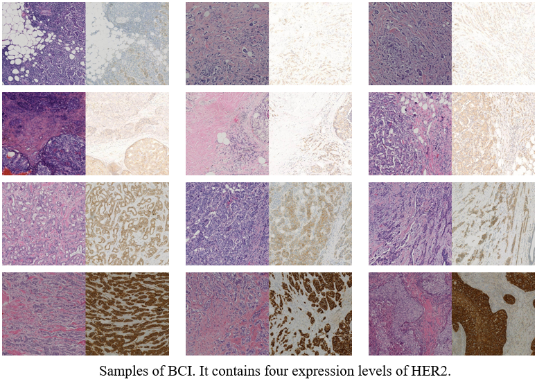
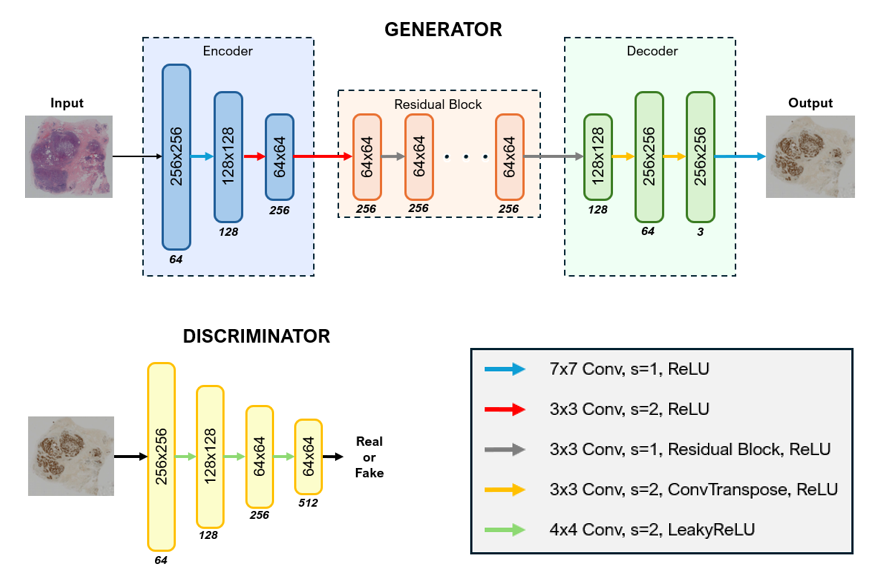
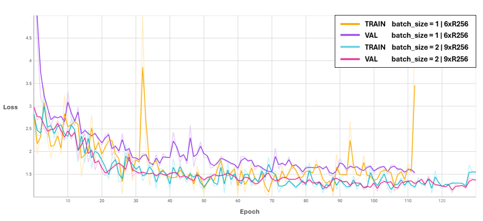

# [AIDL24] AI-Driven Histopathology: Transforming IHC to H&E Stained Images for Enhanced Nuclei Segmentation Using CycleGAN and HoverNet

This repository contains 

### About
Final Project for the UPC [Artificial Intelligence with Deep Learning Postgraduate Course](https://www.talent.upc.edu/ing/estudis/formacio/curs/310402/postgraduate-course-artificial-intelligence-deep-learning/) 2023-2024 edition, authored by:

* [Amaia](linkedin??)
* [João Pedro Vieira](www.linkedin.com/in/joão-pedro-vieira-1369a51b6)
* [Jorge Garcia]()
* [Josep Baradat]()

Advised by [Oscar Pina]()

## Table of Contents 

- [1. Introduction](#1_intro)
    - [1.1. Motivation](#11_motivation)
    - [1.2. Objectives](#12_objectives)
- [2. Corpora](#2_corpora)
    - [2.1. BCI Dataset](#21_bcidataset)
        - [2.1.1. Pre-processing](#211_preprocess)   
    - [2.2. Endonuke Dataset](#22_endonukedataset)
    - [2.3. Pannuke Dataset](#23_pannukeedataset) 
- [3. Methodology??](#3_methodology)
    - [3.1. Time costs](#31_timecosts)
- [4. Environment Requirements](#4_envreqs)
    - [4.1. Software](#41_software)
    - [4.2. Hardware](#42_hardware)
- [5. Experiment's design and results](#5_experimentsdesignandresults)    
    - [5.1. cycleGAN](#51_cycleGAN)
        - [Data preprocessing](#511_datapreprocessing)
        - [Model architecture](#512_modelarchitecture)
        - [Training configuration](#513_trainingconfiguration)
        - [Fine_tuning procedure](#514_finetuningprocedure)
        - [Test results](#515_testresults)
    - [5.2. HoverNet](#52_hovernet)
        - [Data preprocessing](#521_datapreprocessing)
        - [Model architecture??](#522_modelarchitecture)
        - [Training configuration](#523_trainingconfiguration)
        - [Test results](#524_testresults)
    - [5.3. Pipeline ensemble](#53_gans)
        - [Data preprocessing](#531_datapreprocessing)
        - [Ensemble](#532_ensemble)
        - [Test results](#533_testresults)
- [6. How to Run](#6_howtorun)
- [7. Conclusions and future work](#7_conclusionsandfuturework) 
- [8. Acknowledgements](#8_acknowledgements)
 
## 1. Introduction 

### 1.1. Motivation 

### 1.2. Objectives 

## 2. Corpora 

We have trained and tested two different models for our final pipeline. First, we needed to perform a medical image-to-image translation task using a cycleGAN architecture. Then, an instance segmentation of cells nuclei task for medical images. 

For that we used the [BCI Dataset](https://bci.grand-challenge.org/) obtained from the Grand Challenge, the [Endonuke Dataset](https://endonuke.ispras.ru/) and the [Pannuke Dataset]().
These 3 datasets are explained more in detail in section XXX.

### 2.1. BCI Dataset  

For training our cycleGAN model, we used the [BCI dataset](https://bci.grand-challenge.org/) obtained from the Grand Challenge. This dataset is specifically designed for medical imaging tasks and is well-suited for our project's objectives. 
It proposes a breast cancer immunohistochemical (BCI) benchmark attempting to synthesize IHC data directly with the paired hematoxylin and eosin (HE) stained images. 

The original dataset contains 9746 images (4873 pairs), 3896 pairs for train and 977 for test, covering a variety of HER2 expression levels, each with a resolution of 1024x1024 pixels. Some sample HE-IHC image pairs are shown below:

#### 2.1.1. Pre-processing  

- #### Dataset Resolution

Due to the high resolution of the original dataset and in order to accelerate the training process, we built the dataset class with a dynamic cropping feature to be able to work with smaller images. Before feeding them to the network, they are divided into smaller patches, yielding a total of 38984 images (19492 pairs) with a resolution of 512x512 pixels. The dataset is subsequently split into training, validation, and test sets, adhering to a ratio of 60%, 20%, and 20%, respectively.

Below follows an example of how we cropped the original dataset:

- #### Dataset Reduction

We used just 50% of our training and validation sets, to reduce training costs, while keeping a representative sample size for good generalization. Finally, the model was trained with 15592 images (7796 pairs).

- #### Data Augmentation

In order to increase diversity on the training set, we applied several transformations to it, using Albumentations library.
For further reduction of the training time, we resized the images to 256*256. To avoid overfitting, techniques like flips and rotations were applied. Also, we applied normalization of mean and standard deviation and finally we converted the images to tensors so they can be processed by the model.

### 2.2. Endonuke Dataset   

### 2.3. Pannuke Dataset   

## 3. Methodology 

## 4. Environment Requirements 
### 4.1. Software  

We selected PyTorch as the framework for our AI project development due to its robust capabilities in scientific computing and deep learning. Our project leverages several key libraries and tools to enhance its functionality and performance:

**Image Transformations and Augmentations:** We utilized both Torchvision and Albumentations packages for standard augmentations and image transformations, ensuring diverse and effective training data.

**Dataset Preprocessing:** Custom functions and classes were developed for specific preprocessing needs, complemented by the skimage library for additional image processing utilities.

**Architectures and Models:** Our implementations include advanced models such as CycleGAN for image-to-image translation tasks and HoverNet for nuclear segmentation in biomedical images.

**Metrics and Evaluation:** For evaluating the quality of the synthetic images generated by CycleGAN, we employed the Fréchet Inception Distance (FID) metric, ensuring rigorous and accurate assessment of our model's performance.

This combination of powerful libraries and custom solutions has enabled the development of a robust and efficient AI system tailored to our project's requirements.

### 4.2. Hardware   

On an initial phase we started by training our models locally on our laptops but as the project architecture expanded, we rapidly looked for another approach due to the high computing demands.

- **Google Cloud Platform**

To start, we utilized a VM from Google Cloud Platform (GCP) with an Ubuntu Image, equipped with 1 NVIDIA T4 GPU, and a machine type of n1-standard-4 (4 vCPUs, 15 GB memory). As the computational demands increased for model training and to expedite the process, we upgraded to a VM from GCP with an Ubuntu Image, featuring 1 NVIDIA L4 GPU and a machine type of g2-standard-8 (8 vCPUs, 32 GB memory).

To leverage GPU acceleration, we employed CUDA, significantly enhancing our processing capabilities. We used Google Cloud Buckets to store and import raw dataset files to the VM. Additionally, we utilized the gcloud SDK for seamless data import/export to and from the VM.

For accessing the VM and conducting our work, we established an SSH connection and utilized Visual Studio Code with the remote-ssh extension. This setup provided an efficient and flexible environment for developing and training our AI models.

## 5. Experiment's Design and Results 

### 5.1. CycleGAN   

For our image-to-image translation tasks, we implemented CycleGAN, an innovative model introduced by _Jun-Yan Zhu et al._ on this [paper](https://arxiv.org/pdf/1703.10593). This architecture leverages a cycle-consistency loss to enable the transformation of images from one domain to another without direct correspondence between the datasets.

Here is a visual explanation of the overall pipeline of the CycleGAN:

- #### Architecture

Our CycleGAN model's generator architecture includes two downsampling layers, nine residual blocks, and two upsampling layers. The discriminator architecture ias a 70 X 70 PatchGAN, consisting of a series of convolutional layers without downsampling or upsampling, progressively reducing the spatial dimensions to make real or fake predictions. The activation functions used in these networks are pivotal for their performance. Leaky ReLU is employed in the discriminator to allow a small gradient when the unit is not active, mitigating the issue of vanishing gradients. For the generator, ReLU is used in the residual blocks to facilitate efficient training and stable gradient flow. At the output layer of the generator, a Tanh activation function is used to scale the output to the range [-1, 1].

- #### Hyperparameter Tuning

During training, we used an Adam optimizer with beta1=0.5 and beta2=0.999. Our early experiments involved a batch size of 1 and 6 residual blocks in the generator, which yielded moderate results. However, after increasing the batch size to 2 and the number of residual blocks to 9, we observed a smoother convergence and a lower loss from the beginning. We estimate that this improvement can be attributed to the larger batch size providing more stable gradient estimates, and the increased number of residual blocks allowing the model to capture more intricate details in the images. Additionally, we incorporated identity loss with a lambda of 0.5, helping to preserve the format and characteristics of the original domain during translation. These adjustments significantly enhanced the stability and quality of the generated images, demonstrating the importance of hyperparameter tuning in training deep learning models.

- #### Transfer Learning to final dataset

By incorporating CycleGAN with these architectural and training optimizations, we achieved effective and visually appealing results in our image translation tasks, showcasing the model's versatility and robustness.

## 6. How to Run 

## 7. Conclusions and Future Work  

## 8. Acknowledgements 

We would like to thank all the staff from the Prostgraduate Course on Artificial Intelligence with Deep Learning for all the effort and care that they took and showed preparing the materials and lecture which provided us with the tools to build this project.

We would like to give a special thanks to Oscar, our advisor, who provided very helpful advise and spent numerous hours revising our material and searching tricks and tips for our project.
