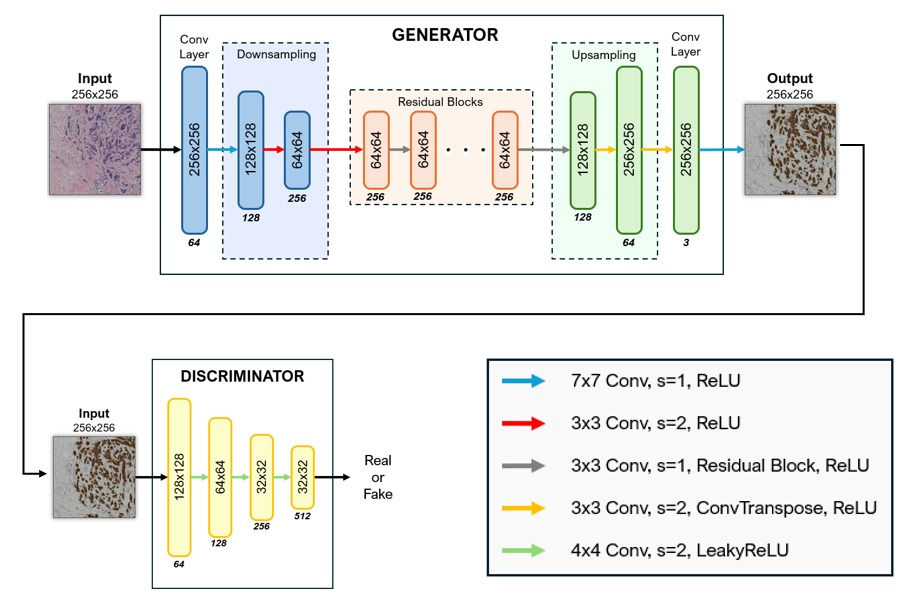
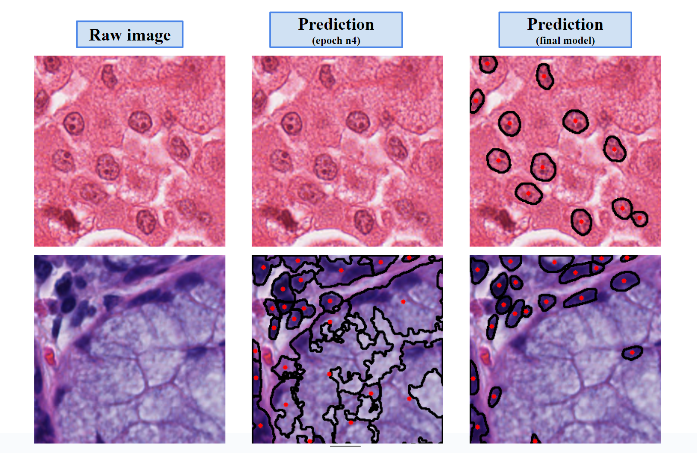
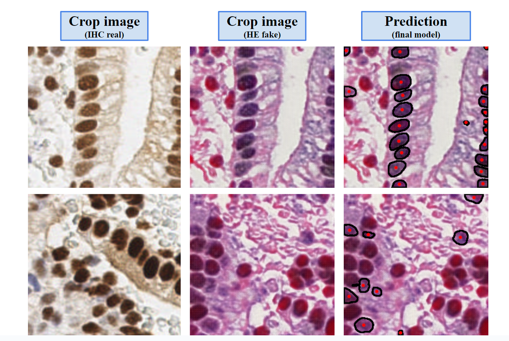

# AIDL24: Enhancing Histopathology: CycleGAN-Based Image Generation and Cell Segmentation with HoverNet

### About
Final Project for the UPC [Artificial Intelligence with Deep Learning Postgraduate Course](https://www.talent.upc.edu/ing/estudis/formacio/curs/310402/postgraduate-course-artificial-intelligence-deep-learning/) 2024 summer semester, authored by:

* [Amaia Zurinaga Gutierrez](https://www.linkedin.com/in/amaia-zurinaga-gutierrez)
* [João Pedro Vieira](https://www.linkedin.com/in/joão-pedro-vieira-1369a51b6)
* [Josep Baradat](https://www.linkedin.com/in/josep-baradat-mar%C3%AD/)
* [Jorge G. Pombo](https://www.linkedin.com/in/jorge-garc%C3%ADa-pombo-373790225/)

Advised by [Oscar Pina](https://www.linkedin.com/in/oscar-pina/)

## Table of Contents <a name="toc"></a>

- [1. Introduction](#1_intro)
    - [1.1. Motivation](#11_motivation)
    - [1.2. Objectives](#12_objectives)
- [2. Tools and technologies](#2_toolstechnologies)
    - [2.1. Software](#21_software)
    - [2.2. Hardware](#22_hardware) 
- [3. Methodology](#3_methodology)
    - [3.1. Time costs](#31_timecosts)
- [4. Data Overview](#4_dataoverview)
    - [4.2. BCI dataset](#41_bcidataset)
    - [4.3. Pannuke dataset](#42_pannukedataset)
    - [4.4. Endonuke dataset](#43_endonukedataset) 
- [5. Experiment's design and results](#5_experimentsdesignandresults)    
    - [5.1. cycleGAN](#51_cycleGAN)
        - [Model architecture](#511_modelarchitecture)
        - [Data preprocessing](#512_datapreprocessing)
        - [Training configuration](#513_trainingconfiguration)
        - [Test results](#515_testresults)
    - [5.2. HoverNet](#52_hovernet)
        - [Data preprocessing](#521_datapreprocessing)
        - [Model architecture](#522_modelarchitecture)
        - [Training configuration](#523_trainingconfiguration)
        - [Test results](#524_testresults)
    - [5.3. Pipeline](#53_pipeline)
        - [Data preprocessing](#531_datapreprocessing)
        - [Ensemble](#532_ensemble)
        - [Test results](#533_testresults)
- [6. How to Run](#6_howtorun)
- [7. Conclusions and future work](#7_conclusionsandfuturework) 
- [8. Acknowledgements](#8_acknowledgements)
 
## 1. Introduction <a name="1_intro"></a>

In this project, we propose a novel approach that uses **CycleGAN**, a type of Generative Adversarial Network (GAN), to translate **IHC stained images to HE staining** and vice versa. CycleGAN has shown remarkable results in image-to-image translation tasks, even when there are no paired examples in the training set. By training a CycleGAN model on unpaired IHC and HE stained images, we aim to generate synthetic HE images from IHC input. This could potentially save a significant amount of time and resources in the staining process.

After that, a HoverNet model (trained on HE images) was employed to calculate **cell centroids** on the translated HE images. The location of cell centroids can provide valuable information about the spatial distribution of cells, which is often an important factor in disease diagnosis.

Both models were then ensembled in a Pipeline so that it is possible to calculate the centroids in IHC stained images without having a model trained with this kind of staining.

### 1.1. Motivation <a name="11_motivation"></a>


Histopathological imaging plays a **crucial role** in medical diagnosis and research. It provides a detailed view of the biological tissues at a microscopic level, enabling the identification of diseases such as cancer. Two common staining techniques used in histopathology are **Immunohistochemistry (IHC)** and **Hematoxylin and Eosin (HE)** staining.

Using of biopsy method is a reliable method to detect cancer with more confidence than utilizing only radiology. The biopsy is a medical procedure involving extraction of sample cells or tissues for fixing a part of them in formalin and paraffin on a glass microscope slide which is achieved by surgery from tissue. 

**Hematoxylin and eosin (HE) staining** is the most widely used staining technique in medical diagnosis. It uses hematoxylin, which stains nuclei blue, and eosin, which stains the cytoplasm and extracellular matrix pink. This results in a high contrast image that allows pathologists to distinguish different tissue structures and cell types.

If the experts need to know more information about exact type of cancer they will use different biomarker such as  **immunohistochemistry (IHC) staining**. This complementary staining are usually used along with H&E to achieve more accurate diagnosis. ??[2]
IHC staining is used to detect specific antigens in tissues with the help of antibodies. It is particularly useful in the identification of abnormal cells such as those found in cancerous tumors.

However, there are limitations to using IHC technology: 1) The preparation of IHC-stained sections is costly. 2) Tumors are heterogeneous, yet IHC staining is typically performed on a single pathological section in clinical settings, which may not fully represent the tumor's status. Moreover, the process of staining is time-consuming and requires expert knowledge to interpret the results.This is where **Deep Learning** can make a significant impact.

Therefore, our goal is to directly generate IHC images from HE images and vice versa. This approach would reduce the costs associated with IHC staining and allow the generation of IHC images from multiple pathological tissues of the same patient, providing a more comprehensive assessment of HER2 expression levels.

Additionally, after transforming the real IHC stained images into fake HE images, cell and centroid predictions between the real and fake images can be compared, ensuring the accuracy and reliability of our generated images in reflecting true pathological features.

 
### 1.2. Objectives <a name="12_objectives"></a>

The main purpose of this project is to elaborate a method that 

- Translate IHC images to HE and vice versa, getting the most reliable and trustworthy results as possible. 

- Build a pipeline that receives IHC images and predicts cell centroids locations. But instead of training an instance segmentation model on IHC images, it will be trained exclusively on HE images, because HE images are much more abundant and, therefore, a better model can be obtained. In order to achieve it, two models will conform the pipeline: The cycleGAN created for the first objective; and a HoverNet model, trained on HE images, to predict cell centroids present in the generated images.

Consequently, the pipeline will have the following structure:

<p align="center">
  
</p>

- And finally, draw conclusions from the obtained results.

## 2. Tools and technologies <a name="2_toolstechnologies"></a>

### 2.1. Software  <a name="21_software"></a>

PyTorch was selected as the framework for our AI project development due to its robust capabilities in scientific computing and deep learning. Our project leverages several key libraries and tools to enhance its functionality and performance:

**Image Transformations and Augmentations:** Both Torchvision and Albumentations packages were utilized for standard augmentations and image transformations, ensuring diverse and effective training data.

**Dataset Preprocessing:** Custom functions and classes were developed for specific preprocessing needs, complemented by the skimage library for additional image processing utilities.

**Architectures and Models:** Advanced models, such as CycleGAN for image-to-image translation tasks and HoverNet for nuclear segmentation in biomedical images, were included.

**Metrics and Evaluation:** For evaluating the quality of the synthetic images generated by CycleGAN, the Fréchet Inception Distance (FID) metric was employed, ensuring rigorous and accurate assessment of the model's performance.

This combination of powerful libraries and custom solutions has enabled the development of a robust and efficient AI system tailored to our project's requirements.


### 2.2. Hardware  <a name="22_hardware"></a> 

- **Google Cloud Platform**

On an initial phase the models were trained locally on personal laptops but as the project architecture expanded, Google Cloud was required due to the high computing demands.

To start, a VM from Google Cloud Platform (GCP) with an Ubuntu Image, equipped with 1 NVIDIA T4 GPU, and a machine type of n1-standard-4 (4 vCPUs, 15 GB memory) was utilized. As the computational demands increased for model training and to expedite the process, it was upgraded to a VM from GCP with an Ubuntu Image, featuring 1 NVIDIA L4 GPU and a machine type of g2-standard-8 (8 vCPUs, 32 GB memory).

To leverage GPU acceleration, CUDA was employed, significantly enhancing the processing capabilities. Google Cloud Buckets was used to store and import raw dataset files to the VM. Additionally, the gcloud SDK was utilized for seamless data import/export to and from the VM. For accessing the VM and conducting our work, an SSH connection was established.

This setup provided an efficient and flexible environment for developing and training our AI models.ç


- **Students' personal laptops**

**MacBook Pro**
- Procesador: 2,6 GHz Intel Core i7

- Grafica: Intel UHD Graphics 630 1536 MB
  
- Memoria: 16 GB 2667 MHz DDR4


**Asus Vivobook**
 - Procesador: i7-13700H 2.40 GHz

 - RAM: 32,0 GB
 
 - OS: Windows 11
 
 - Grafica: Nvidia RTX 4060


**Lenovo Legion Pro 5**
- Procesador: AMD Ryzen™ 9 7945HX (2,50 GHz hasta 5,40 GHz)
  
- RAM: 32 GB DDR5-5200MHz (SODIMM) - (2 x 16 GB)
  
- OS: Windows 11
  
- Grafica: NVIDIA® GeForce RTX™ 4070 8 GB GDDR6


**Lenovo Legion Y720**
- Procesador: Intel Core i7-7700HQ (Quad-Core, 2.8 GHz, up to 3.8 GHz with Turbo Boost)
  
- RAM: Up to 16 GB DDR4 (2400 MHz)
  
- OS: Windows 10
  
- Grafica: NVIDIA® GeForce GTX 1060 (6 GB GDDR5 VRAM)


## 3. Methodology <a name="3_methodology"></a>

One-hour meetings were held weekly between the team and the advisor. Besides from that, another two two-hour meetings were held weekly by the team without the advisor.
Moreover two sprints were done during the development procedure. The last week before the critical review, and three weeks before the final presentation. During those sprints, the amount of time spent by each student on the project was roughly doubled.

### 3.1. Time costs  <a name="31_timecosts"></a>


<p align="center">
  
</p>


## 4. Data overview <a name="4_dataoverview"></a>

### 4.1. BCI Dataset  <a name="41_bcidataset"></a>  

The [BCI dataset](https://bci.grand-challenge.org/) was obtained from the Grand Challenge and used to train the cycleGAN model. This dataset is specifically designed for medical imaging tasks and is well-suited for the project's objectives. 
It proposes a breast cancer immunohistochemical (BCI) benchmark attempting to synthesize IHC data directly with the paired hematoxylin and eosin (HE) stained images. 

The original dataset contains 9746 images (4873 pairs), 3896 pairs for train and 977 for test, covering a variety of HER2 expression levels, each with a resolution of 1024x1024 pixels. Some sample HE-IHC image pairs are shown below:


<p align="center">
  
</p>


### 4.3. Pannuke Dataset  <a name="42_pannukedataset"></a> 

For the image segmentation model training, validation and testing, we utilize the [PanNuke](https://doi.org/10.48550/arXiv.2003.10778) dataset, which is a semi-automatically generated resource designed for the segmentation and classification of nuclei. Models trained on PanNuke can aid in whole slide image tissue type segmentation, and generalize to new tissues. This dataset includes 7753 images spanning 19 different tissue types: adrenal gland, bile duct, bladder, breast, cervix, colon, esophagus, headneck, kidney, liver, lung, ovarian, pancreatic, prostate, skin, stomach, testis, thyroid and uterus. The PanNuke dataset is organized into three folds (fold 1, fold 2, and fold 3), each containing two folders: "image" and "masks." The "image" folder comprises two files: images.npy and types.npy, while the "masks" folder contains a single file: masks.npy.. 

<p align="center">
  
</p>


### 4.3. Endonuke Dataset  <a name="43_endonukedataset"></a> 
EndoNuke is a dataset designed for training models to detect nuclei in endometrium samples. It contains over 1606 images with size 200x200px and 174 images with size 400x400px. They were created using the immunohistochemistry technique (IHC). 
Each image has a physical size of 100μm x 100μm, and includes annotated nuclei locations marked as keypoints for: stroma, epithelium, and other.

The dataset can be found [here.](https://endonuke.ispras.ru)

<p align="center">
  
</p>


## 5. Experiment's Design and Results <a name="5_experimentsdesignandresults"></a>

### 5.1. CycleGAN  <a name="51_cyclegan"></a>

For our image-to-image translation tasks, we implemented CycleGAN, an innovative model introduced by _Jun-Yan Zhu et al._ on this [paper](https://arxiv.org/pdf/1703.10593). This architecture leverages a cycle-consistency loss to enable the transformation of images from one domain to another without direct correspondence between the datasets.

Here is a visual explanation of the overall pipeline of the CycleGAN:

<p align="center">
  
</p>


### 5.1.1. Model Architecture <a name="512_modelarchitecture"></a>


Our CycleGAN model's generator architecture includes two downsampling layers, nine residual blocks, and two upsampling layers. The discriminator architecture ias a 70 X 70 PatchGAN, consisting of a series of convolutional layers without downsampling or upsampling, progressively reducing the spatial dimensions to make real or fake predictions. The activation functions used in these networks are pivotal for their performance. Leaky ReLU is employed in the discriminator to allow a small gradient when the unit is not active, mitigating the issue of vanishing gradients. For the generator, ReLU is used in the residual blocks to facilitate efficient training and stable gradient flow. At the output layer of the generator, a Tanh activation function is used to scale the output to the range [-1, 1].

<p align="center">
  
</p>

### 5.1.2. Data Preprocessing <a name="511_datapreprocessing"></a>

- #### Dataset Resolution

Due to the high resolution of the original dataset and in order to accelerate the training process, we built the dataset class with a dynamic cropping feature to be able to work with smaller images. Before feeding them to the network, they are divided into smaller patches, yielding a total of 38984 images (19492 pairs) with a resolution of 512x512 pixels. The dataset is subsequently split into training, validation, and test sets, adhering to a ratio of 60%, 20%, and 20%, respectively.

Below follows an example of how we cropped the original dataset:

<p align="center">
  
</p>

- #### Dataset Reduction

We used just 50% of our training and validation sets, to reduce training costs, while keeping a representative sample size for good generalization. Finally, the model was trained with 15592 images (7796 pairs).

- #### Data Augmentation

In order to increase diversity on the training set, we applied several transformations to it, using Albumentations library.
For further reduction of the training time, we resized the images to 256*256. To avoid overfitting, techniques like flips and rotations were applied. Also, we applied normalization of mean and standard deviation and finally we converted the images to tensors so they can be processed by the model.


### 5.1.3. Training Configuration <a name="513_modelarchitecture"></a>

- #### First Approach
First, we trained our network from scratch and for that we used the Adam optimizer with a learning rate of 0.00001. Our early experiments involved training with a batch size of 1, 6 residual blocks in the generator and a cycle_lambda=10, which yielded good results but started overfitting after 87 epochs. 

Below we present the generators loss during the first training process:

<p align="center">
  
</p>

- #### Second Approach

However, after increasing the batch size to 2 and the number of residual blocks to 9, while maintaining the same lr and cycle_lambda, we observed a smoother convergence and a lower loss from the beginning. Additionally, we incorporated identity loss with a lambda=0.5, helping to preserve the format and characteristics of the original domain during translation. These adjustments significantly enhanced the stability and quality of the generated images. After 123 epochs the model started to overfit.

Below we present the generators loss during the second training process:

<p align="center">
  
</p>

We estimate that this improvement can be attributed to the larger batch size providing more stable gradient estimates, and the increased number of residual blocks allowing the model to capture more intricate details in the images.

### 5.1.5. Test Results <a name="515_modelarchitecture"></a>

After training our CycleGAN model, we evaluated its performance using several metrics on the test set. Among these, the Fréchet Inception Distance (FID) was employed, which is commonly used to assess the fidelity of generated images compared to real images. FID measures the similarity in statistics between generated and real images based on features extracted from a pre-trained Inception model. Additionally, we monitored the generator losses throughout the testing phase to gauge the convergence and stability of our model.

| Metric          | Score |
|-----------------|-------|
| FID Score (HE) | 23.22 |
| FID Score (IHC) | 48.54 |
| Generators Loss | 1.43 |

Below we also present some of the test results obtained with the BCI Dataset, which has paired images and allowed us to have a better visual perception of the model's ability to perform the pretended image-to-image translation tasks.

- #### Translation from Domain A to Domain B [G(x)]

Here are some examples with particular focus on comparing the transformation from domain A to domain B with the domain B ground truth:

<div align="center">
  
  
  <p><sub><strong>Examples of CycleGAN inference results. Left input image from IHC domain; Right input image from HE domain.</strong></sub></p>
</div>

- #### Reconstruction Translation [F(G(x))]

Here are some examples showcasing the model's cycle consistency. Each example contrasts the original images from domain A with their reconstructions obtained through transformation into domain B and back:

<div align="center">
  
  
  <p><sub><strong>Examples of CycleGAN inference results. Left input image from HE domain; Right input image from IHC domain.</strong></sub></p>
</div>


### 5.1.6. Model Limitations <a name="516_ganLimitations"></a>

There are some limitations regarding our CycleGAN model for image-to-image translation between Hematoxylin and Eosin (HE) and Immunohistochemistry (IHC) stains of medical images of body tissue.

**Color Translation Accuracy:** The model sometimes struggles to accurately translate the colors of the images from one domain to the other. This can result in discrepancies between the generated output and the ground truth images, particularly in the finer details and color gradients that are crucial for medical diagnoses.

<div align="center">
  
  <p><sub><strong>Visualization of translation from IHC to HE stained images. The output generated struggles in obtaining the desired colour.</strong></sub></p>
</div>

**High HER2 Expression Identification:** Specifically, when translating from HE to IHC stains, the model has difficulty accurately identifying regions with higher expressions of HER2. This can lead to inaccuracies in highlighting cancer areas in the IHC images, which is critical for effective diagnosis and treatment planning.

<div align="center">
  
  <p><sub><strong>Visualization of translation from HE to IHC stained images with high expression levels of HER2. The output generated does not highlight accurately the expression levels of HER2.</strong></sub></p>
</div>


**Potential Artifacts:** In line with the limitations mentioned above, the translation process may introduce artifacts or distortions that are not present in the original images. These artifacts can potentially interfere with the interpretation of the images by pathologists and clinicians.


### 5.2. Hovernet  <a name="#52-hovernet"></a>

The HoVer-Net [(_Graham et al._)](https://doi.org/10.1016/j.media.2019.101563) is a single network with multiple branches that carries out both nuclear instance segmentation and classification. This network utilizes the horizontal and vertical distances from nuclear pixels to their centers of mass to distinguish between clustered cells. Additionally, a specialized up-sampling branch is employed to classify the type of each nuclear instance segmented.

<div align="center">
  
  <p><strong>HoVer-Net original architecture (Graham et al., 2019)</strong></p>
</div>
	
### 5.2.1. Data preprocessing<a name="521_datapreprocessing"></a>

The data processing was meticulously developed to handle image and mask data from the PanNuke dataset, segmented across multiple folds. Initially, image and mask files stored in NumPy array format were aggregated from three distinct folds (Fold 1, Fold 2, Fold 3) to form comprehensive datasets. These files were accessed from nested directories structured specifically for this purpose and were concatenated to create unified arrays for images and masks. The data was then prepared for training by segmenting it into training, validation, and test subsets, which represent 60% (4740/7901), 20% (1580/7901), and 20% (1581/7901) of the data, respectively. The transformation process included converting instance segmentation masks into a format compatible with the Hover-Net architecture, which involved remapping segmentation indices and encoding cell type information into a five-channel NumPy array per image (7901, 256, 6). Each processed image was saved as a .npy file in designated directories corresponding to their respective data splits. Additionally, for inference, visualization and verification, test images were converted into PNG format (256x256) and stored, ensuring that the pixel intensity values were properly scaled to the 8-bit range suitable for standard image formats. 

### 5.2.2. Model architecture<a name="522_modelarchitecture"></a>

In the "fast" mode of the HoVer-Net model, the architecture is designed for efficiency while maintaining a strong capability for feature extraction and segmentation tasks. The model starts with an initial convolutional layer (conv0) that employs a 7x7 kernel to process the input image, followed by batch normalization and ReLU activation. This layer is prepended with a TFSamepaddingLayer to maintain the dimensionality across convolutions.

The core of the network comprises four sets of residual blocks (d0, d1, d2, d3), which progressively increase the depth and reduce the spatial dimensions of the feature maps. Specifically, the architecture includes:

- d0: 3 residual blocks, transitioning from 64 to 256 channels.
- d1: 4 residual blocks, increasing channel depth from 256 to 512.
- d2: 6 residual blocks, further deepening to 1024 channels.
- d3: 3 residual blocks, culminating in 2048 channels.
  
A convolutional bottleneck layer (conv_bot) then compresses the channel depth from 2048 to 1024 to prepare for the decoding process. The decoder architecture in the "fast" mode uses a kernel size of 3 for all convolutional operations, which is smaller than in the "original" mode, allowing for quicker processing with reduced computational overhead.

The decoder consists of four sequential stages that progressively upsample and concatenate feature maps from corresponding encoder stages, refining details through a series of dense blocks and convolutional layers. Each stage in the decoder is designed to integrate high-level semantic information with lower-level details to generate precise segmentation outputs.

The model concludes with the UpSample2x module, used at each decoder stage to gradually restore the resolution of the output feature maps, culminating in the final segmentation maps corresponding to different types of predictions (nuclear, cytoplasmic, etc.), depending on the configuration.

<div align="center">
  
  <p><strong>Hovernet "fast" architecture</strong></p>
</div>

### 5.2.3. Training configuration<a name="523_modelarchitecture"></a>

In the training configuration of our project, we adopted a structured multi-phase approach to train the neural network using the HoVer-Net model in its 'fast' mode. The model was equipped with a total of 16 residual blocks distributed across four distinct depth levels: 3 blocks in d0, 4 blocks in d1, 6 blocks in d2, and 3 blocks in d3. This architecture was selected to optimize the model’s learning capabilities for faster execution without compromising the integrity of feature extraction.

Each phase was precisely defined to control the learning process, with an Adam optimizer initiated at a learning rate of 0.0025, fine-tuned through a MultiStepLR scheduler at predetermined epochs to enhance training efficacy. We managed the batch sizes at 2 for both training and validation to ensure a balance between computational resource utilization and model accuracy.

Throughout the training process, key metrics were meticulously recorded and saved using a series of callbacks integrated into the training and validation engines. These included ScalarMovingAverage for tracking moving averages of scalar metrics, TrackLr for monitoring learning rate changes, and PeriodicSaver for saving model states periodically. Additionally, VisualizeOutput and LoggingEpochOutput were employed to log and visualize outputs at each epoch, providing vital feedback on model performance and stability. AccumulateRawOutput and ProcessAccumulatedRawOutput played crucial roles during validation phases, collecting and processing outputs for detailed analysis.

<div align="center">
  
</div>

<div align="center">
  
</div>

Initially, we commenced training our model using the Pannuke dataset according to the method outlined above. However, to optimize our resource utilization and expedite the development process, we decided to leverage the pretrained model checkpoints shared by the HoVer-Net creators with the community. By starting from these pretrained checkpoints, we significantly reduced the amount of time required for training and fine-tuning our model. This strategic decision not only accelerated our project timeline but also ensured that we maintained high standards of accuracy and efficiency in our model's performance, benefiting from the robust foundation provided by the pretrained model.

### 5.2.4. Test results<a name="524_modelarchitecture"></a>

We utilized several key metrics to comprehensively evaluate the performance of the HoVer-Net model in the segmentation of cellular nuclei in Pannuke images. The Dice Coefficient (DICE), a metric that measures the overlap between the model’s predictions and the true data, showed a performance of 0.82773, indicating a high degree of precision in pixel-level segmentation. The Average Jaccard Index (AJI), which assesses the intersection over union of predicted and actual instances, was recorded at 0.66529, reflecting the model’s effectiveness in distinguishing individual instances. To evaluate the model's capabilities in both detection and segmentation, we employed the Panoptic Quality (PQ) metric, combining Detection Quality (DQ) and Segmentation Quality (SQ). The PQ score was 0.63851, supported by DQ and SQ scores of 0.76210 and 0.81638 respectively, demonstrating the model’s robustness in accurately detecting and segmenting instances. The enhanced metric Average Jaccard Index Plus (AJI+), which considers additional factors like segmentation fragmentation, further validated the model’s detailed performance with a score of 0.67720.

| Metric           | Score   |
|------------------|---------|
| Dice Coefficient (DICE) | 0.82773 |
| Average Jaccard Index (AJI) | 0.66529 |
| Detection Quality (DQ) | 0.76210 |
| Segmentation Quality (SQ) | 0.81638 |
| Panoptic Quality (PQ) | 0.63851 |
| Average Jaccard Index Plus (AJI+) | 0.67720 |


Below we also present some of the test results obtained with the Pannuke Dataset after running the inference:

<div align="center">
  
</div>
### 5.3. Pipeline  <a name="53-pipeline"></a> 

- Data preprocessing<a name="531_datapreprocessing"></a>

Endonuke dataset was used to test the pipeline. 
Starting from real IHC images from endonuke, fake HE images were generated. Then the centroids of these fake images were calculated using the Hovernet model. And finally, the predicted and real centroids were compared, as a way of evaluating our models together.

The information of the centroids of each image is stored in the labels/bulk subdirectory. These annotations consist of three columns. The two first columns are the x-coordinate and the y-coordinate of the centroid of each cell. The third column is the class_label: 1 for stroma, 2 for epithelium and 0 for other.

In order to use this dataset with the cycleGAN model, some preprocessing was required. Images were converted to the appropriate size (256x256) and the coordinates of the centroids of these images were recalculated.

All images were resized to 400x400 and its centroids' coordinates readapted.
After that, three 256x256 crops were taken out of each image and their centroids were recalculated again on the cropped images.


<p align="center">
  
</p>

- Ensemble<a name="532_emsemble"></a>

The preprocessed endonuke data was used as input of the cycleGAN model (using the weights obtained during training) in order to create a fake HE image from each cropped image. Resulting images were stored in the gan_results_folder and with the same name as the original cropped images.

Up next, the Hover-Net model was used to obtain the results of the instance segmentation for the fake HE images. These results were stored in the result_hover_folder, including a folder containing the JSON files where the predicted centroids are located.

The main objective of the pipeline is to compare the real centroids of Endonuke's IHC images with the predicted centroids of the fake HE images. This fake HE images were generated with the CycleGAN model and their centroids were calculated with the Hovernet model.

To do this comparison, “Hungarian Matching” was performed between the real and predicted centroids of each image based on its distance.


- Test results<a name="533_modelarchitecture"></a>

For testing the pipeline's performance, the whole endonuke dataset was provided to the pipeline as input. Here is an example of the obtained results.

<div align="center">
  
</div>

After comparing the distance between the real centroids of the Endonuke dataset (centroids on IHC images) and the predicted centroids on the fake Endounuke dataset (centroids on fake HE images) the following metrics were obtained.

Note that this comparison method uses a distance threshold and if the distance between the predicted and real centroids is less than said threshold, the prediction is labeled as correct. This way, the utilized metrics are classification metrics.


| Metric           | Score   |
|------------------|---------|
| F1 | 0.76826 |
| Precision | 0.72825 |
| Recall | 0.81293 |


## 6. How to Run <a name="6_howtorun"></a>

- clone the repository.
- Create new environment.
- run: pip install -r requirements.txt 
- install CUDA

### How to download and prepare datasets

#### BCI Dataset

1. Download BCI Dataset from [here](https://drive.google.com/file/d/1jPPh-rxUaj_bCB58F9mfg9hjY7JjVt3O/view?usp=drive_link). If it is not possible, you can also enter on [this](https://drive.google.com/drive/folders/1jApbId20lX8AY0tIsoX2_2BHBLPoxD4L) google drive folder and download it from there.
  
2. Extract and save the dataset

	After downloading the dataset you will obtain a `.zip` file called `BCI_dataset`. You should extract the content inside that should be a folder called `BCI_dataset`, rename it to `BCI` and save it on the `/path/to/the/repository/Datasets`.

	Once you have done that, the file structure should be like this: 

	```
	 IHC_HE_GenAI
	  ├──Datasets
	       ├── BCI
		     ├──train
		     |    ├── 00000_train_1+.png
		     |    ├── 00001_train_3+.png
		     |    └── ...
		     └──test
			  ├── 00000_test_1+.png
			  ├── 00001_test_2+.png
			  └── ...
	```

### Endonuke Dataset

### Pannuke Dataset


### How to train CycleGAN

1. File structure and description
	```
	 IHC_HE_GenAI
	  ├──cycleGAN
	     ├── __init__.py
	     ├── config.py
	     └── ...
	```
 	
 	The python scripts inside `/path/to/the/repository/cycleGAN` are as follow:
	
 	| File          | Description |
	|-----------------|-------|
	| init.py  | Initializes the package and can include any necessary package-level variables or imports |
	| config.py | Contains configuration settings and hyperparameters for the CycleGAN model, including paths, image transformations, training parameters, and model parameters |
	| discriminator.py | Defines the architecture and implementation of the discriminator networks used in the CycleGAN |
	| generator.py | Defines the architecture and implementation of the generator networks used in the CycleGAN |
	| HE_IHC_dataset.py | Manages the loading, preprocessing, and augmentation of the HE and IHC datasets for training and testing |
	| train.py | Contains the training loop and logic for training the CycleGAN model, including loss calculations and model updates |
	| test.py | Implements the testing and evaluation logic for the trained CycleGAN model on new data |
	| utils.py | Provides utility functions used throughout the project, such as saving/loading models, and other helper functions |
	| evaluate.py | Contains functions for evaluating the performance of the CycleGAN model |


2. Change configuration settings and hyperparameters for the CycleGAN model

	Open the `/path/to/the/repository/cycleGAN/config.py` and change the `TRAIN_DIR_IHC` and `TRAIN_DIR_HE` variables to these:
	```
 	TRAIN_DIR_IHC = bci_dataset_ihc_train   
 	TRAIN_DIR_HE = bci_dataset_he_train
 	```
 	Then, open the `/path/to/the/repository/cycleGAN/utils.py` file and change `import cycleGAN.config as config` to `import config`. If you want you can change other hyperparameters (e.g. learning rate, batch_size, num_res_blocks, etc), which are all on the `/path/to/the/repository/cycleGAN/config.py`, to compare the difference in training time and results. All the hyperparameters are described on that file, for better understanding of their role in the model.


3. Run the following command on the terminal to start training the model:
	```
 	python3 /path/to/the/repository/cycleGAN/train.py
 	``` 
	You can monitor and track the model training by opening with tensorboard the `/path/to/the/repository/cycleGAN/logs` folder, where you can find different metrics. Also, you can check some examples of the cycleGAN output images throughout training, validation and test in `/path/to/the/repository/cycleGAN/gan-img/` to have a better visual understanding of the outputs the model is generating.


### How to train HoVer_Net

1. Click here to download the Pannuke dataset: [Fold 1](https://warwick.ac.uk/fac/cross_fac/tia/data/pannuke/fold_1.zip), [Fold 2](https://warwick.ac.uk/fac/cross_fac/tia/data/pannuke/fold_2.zip), [Fold 3](https://warwick.ac.uk/fac/cross_fac/tia/data/pannuke/fold_3.zip); (source: [https://warwick.ac.uk/fac/cross_fac/tia/data/pannuke](https://warwick.ac.uk/fac/cross_fac/tia/data/pannuke))

2. Save Pannuke dataset (Fold 1, Fold 2, Fold 3) inside "data" folder (\IHC_HE_GenAI\Datasets\Pannuke\data)

3. Run the following command on the terminal:
	
  ```
 	python Hover_net\hover_net2\data_prep.py\data_prep.py
 	``` 

  The dataset inside "data" (Fold 1, Fold 2, Fold 3) will be automatically separated in 3 folders:
    	```
	 IHC_HE_GenAI/Datasets/Pannuke/data/
	  ├── train
		├── val
	  └── test
	```

4. Run the following command on the terminal:
	
  ```
 	python Hover_net\hover_net2\run_train.py\run_train.py
 	``` 

5. To acess the train loss, train oupts, validation loss and validation ouput; launch Tensorboard by clickin on "Launch TensorBoard Session" in line 31 of the "run_train.py" file

6. The checkpoints will be stored inside the "checkpoint" folder, in a subfolder called "00". 
    	```
	 \IHC_HE_GenAI\Hover_net\hover_net2\checkpoint\
	  ├── 00
	  └── ...
	```


### Pipeline:
This steps will execute the whole pipeline inference procedure using our pretrained models. 

- Download the Endonuke dataset [here.](https://www.ispras.ru/conf/endonuke/data.zip) (source: [https://endonuke.ispras.ru/])(https://endonuke.ispras.ru/))
- Extract the downloaded zip folder in IHC_HE_GenAI/Endonuke. The folder should end up like this:

	```
	 IHC_HE_GenAI/Endonuke/
	  ├──data
	       ├── dataset/
		     ├── master.ymls
		├── __init__.py
		├── crop.py
    ├── preprocessing.py
	  └── resize.py
	```
                         

- Download weights from both cycleGAN and HoverNet models [here.](https://drive.google.com/drive/folders/1_51IjiAmS7YoofXW-xpsaui44lC46Ko8?usp=drive_link) 
- Place the five weight files in IHC_HE_GenAI/pretrained_models. The folder should end up like this:

  	```
	 IHC_HE_GenAI/pretrained_models/
	  ├── hovernet_fast_pannuke_type_tf2pytorch.tar
		├── discriminator_HE.tar
		├── discriminator_IHC.tar
    ├── generator_HE.tar
	  └── generator_IHC.tar
	```
´
- run: Datasets/Endonuke/preprocessing.py if it is the first time you execute it, to generate preprocessed data.
- run: pipeline_run.py

- The intermediate results (fake HE images generated by the cycleGAN) will be stored in IHC_HE_GenAI/Results/gan_results.
- The final results (fake HE images with predicted centroids) will be stored in IHC_HE_GenAI/Results/hover_results.


## 7. Conclusions and Future Work  <a name="7_conclusionsandfuturework"></a>

??Las metricas que se consiguen con hovernet son bastante parecidas si no recuerdo mal. Yo pondría que (1) habéis sido capaces de entrenar el modelo en HE, (2) entrenado la cycle gan para pasar de HE a IHC, y esto sois capaces “bridge the gap between exhaustive annotations in HE and the lack of labeled IHC data"

- When comparing HoverNet metrics on real datasets

- cycleGAN was costly to train. Even though an appropiate and extensive dataset was found, the computational requirements made the training procedure harder.

- Centroid calculation on histopathology images was more difficult to implement than it was initially thought. As cells with the same colouring and shape solaped, widely used techniques did not work properly. That is the reason why the Unet model that was previously implemented had to be discarded in favor on HoverNet, an instance segmentation model specifically designed to deal with this kind of biological samples.


The main steps that can be taken in the future to keep improving the project are the following:
- Perform exhaustive hyperparameter tuning on the cycleGAN model. By utilizing enough computational resources, the model results might be further improved.
- Instead of using HoverNet on our pipeline, the recent state-of-the-art HoverNext model can be adapted to fit in this project's needs.


## 8. Acknowledgements <a name="8_acknowledgements"></a>

We are really grateful to the team from the Postgraduate Course on Artificial Intelligence with Deep Learning. Their lectures and explanations gave us everything we needed for this project.

And of course our special thanks go to Oscar, our advisor. His instructions were critical, and the time he spent reviewing our work made a big difference.
