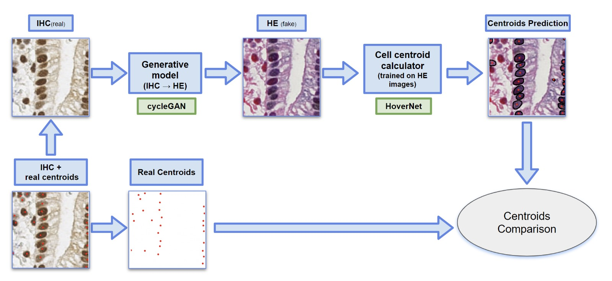
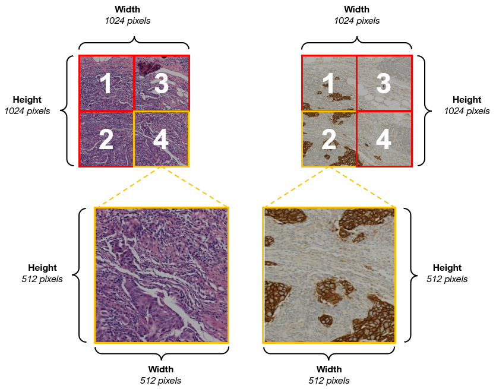
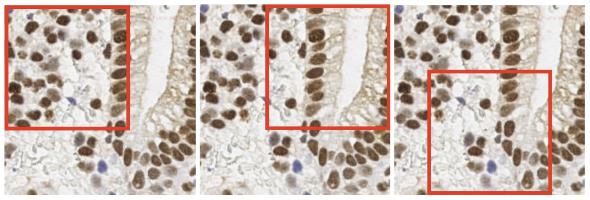

# AIDL24:??

### About
Final Project for the UPC [Artificial Intelligence with Deep Learning Postgraduate Course](https://www.talent.upc.edu/ing/estudis/formacio/curs/310402/postgraduate-course-artificial-intelligence-deep-learning/) 2024 summer semester, authored by:

* [Amaia Zurinaga Gutierrez](https://www.linkedin.com/in/amaia-zurinaga-gutierrez)
* [João Pedro Vieira](https://www.linkedin.com/in/joão-pedro-vieira-1369a51b6)
* [Josep Baradat](https://www.linkedin.com/in/josep-baradat-mar%C3%AD/)
* [Jorge G. Pombo](https://www.linkedin.com/in/jorge-garc%C3%ADa-pombo-373790225/)

Advised by [Oscar Pina](https://www.linkedin.com/in/oscar-pina/)

## Table of Contents 

- [1. Introduction](#1_intro)
    - [1.1. Motivation](#11_motivation)
    - [1.2. Objectives](#12_objectives)
- [2. Tools and technologies](#2_toolstechnologies)
    - [2.1. Software](#21_software)
    - [2.2. Hardware](#22_hardware) 
- [3. Methodology](#3_methodology)
    - [3.1. Time costs](#31_timecosts)
- [4. Data Overview](#4_dataoverview)
    - [4.2. BCI dataset](#41_bcidataset)
    - [4.3. Pannuke dataset](#42_pannukedataset)
    - [4.4. Endonuke dataset](#43_endonukedataset) 
- [5. Experiment's design and results](#5_experimentsdesignandresults)    
    - [5.1. cycleGAN](#51_cycleGAN)
        - [Model architecture](#511_modelarchitecture)
        - [Data preprocessing](#512_datapreprocessing)
        - [Training configuration](#513_trainingconfiguration)
        - [Fine_tuning procedure](#514_finetuningprocedure)
        - [Test results](#515_testresults)
    - [5.2. HoverNet](#52_hovernet)
        - [Data preprocessing](#521_datapreprocessing)
        - [Model architecture](#522_modelarchitecture)
        - [Training configuration](#523_trainingconfiguration)
        - [Test results](#524_testresults)
    - [5.3. Pipeline](#53_pipeline)
        - [Data preprocessing](#531_datapreprocessing)
        - [Ensemble](#532_ensemble)
        - [Test results](#533_testresults)
- [6. How to Run](#6_howtorun)
- [7. Conclusions and future work](#7_conclusionsandfuturework) 
- [8. Acknowledgements](#8_acknowledgements)
 
## 1. Introduction 

In this project, we propose a novel approach that uses **CycleGAN**, a type of Generative Adversarial Network (GAN), to translate **IHC stained images to HE staining** and viceversa. CycleGAN has shown remarkable results in image-to-image translation tasks, even when there are no paired examples in the training set. By training a CycleGAN model on unpaired IHC and HE stained images, we aim to generate synthetic HE images from IHC input. This could potentially save a significant amount of time and resources in the staining process.

After that, a HoverNet model (trained on HE images) was employed to calculate **cell centroids** on the translated HE images. The location of cell centroids can provide valuable information about the spatial distribution of cells, which is often an important factor in disease diagnosis.

Both models were then ensembled in a Pipeline so that it is possible to calculate the centroids in IHC stained images without having a model trained with this kind of staining.

### 1.1. Motivation 

Histopathological imaging plays a **crucial role** in medical diagnosis and research. It provides a detailed view of the biological tissues at a microscopic level, enabling the identification of diseases such as cancer. Two common staining techniques used in histopathology are **Immunohistochemistry (IHC)** and **Hematoxylin and Eosin (HE)** staining.

Using of biopsy method is a reliable method to detect cancer with more confidence than utilizing only radiology. The biopsy is a medical procedure involving extraction of sample cells or tissues for fixing a part of them in formalin and paraffin on a glass microscope slide which is achieved by surgery from tissue. 

**Hematoxylin and eosin (HE) staining** is the most widely used staining technique in medical diagnosis. It uses hematoxylin, which stains nuclei blue, and eosin, which stains the cytoplasm and extracellular matrix pink. This results in a high contrast image that allows pathologists to distinguish different tissue structures and cell types.

If the experts need to know more information about exact type of cancer they will use different biomarker such as  **immunohistochemistry (IHC) staining**. This complementary staining are usually used along with H&E to achieve more accurate diagnosis. ??[2]
IHC staining is used to detect specific antigens in tissues with the help of antibodies. It is particularly useful in the identification of abnormal cells such as those found in cancerous tumors.

However, there are limitations to using IHC technology: 1) The preparation of IHC-stained sections is costly. 2) Tumors are heterogeneous, yet IHC staining is typically performed on a single pathological section in clinical settings, which may not fully represent the tumor's status. Moreover, the process of staining is time-consuming and requires expert knowledge to interpret the results.This is where **Deep Learning** can make a significant impact.

Therefore, our goal is to directly generate IHC images from HE images and viceversa. This approach would reduce the costs associated with IHC staining and allow the generation of IHC images from multiple pathological tissues of the same patient, providing a more comprehensive assessment of HER2 expression levels.

Additionally, after transforming the real IHC stained images into fake HE images, cell and centroid predictions between the real and fake images can be compared, ensuring the accuracy and reliability of our generated images in reflecting true pathological features.

### 1.2. Objectives 

The main purpose of this project is to elaborate a method that 

- Translate IHC images to HE and viceversa, getting the most reliable and trustworthy results as possible. 

- Build a pipeline that receives IHC images and predicts cell centroids locations. But instead of training an instance segmentation model on IHC images, it will be trained exclusively on HE images, because HE images are much more abundant and, therefore, a better model can be obtained. In order to achieve it, two models will conform the pipeline: The cycleGAN created for the first objective; and a HoverNet model, trained on HE images, to predict cell centroids present in the generated images.

Consequently, the pipeline will have the following structure:

  

- And finally, draw conclusions from the obtained results.

## 2. Tools and technologies 

### 2.1. Software  

PyTorch was selected as the framework for our AI project development due to its robust capabilities in scientific computing and deep learning. Our project leverages several key libraries and tools to enhance its functionality and performance:

**Image Transformations and Augmentations:** Both Torchvision and Albumentations packages were utilized for standard augmentations and image transformations, ensuring diverse and effective training data.

**Dataset Preprocessing:** Custom functions and classes were developed for specific preprocessing needs, complemented by the skimage library for additional image processing utilities.

**Architectures and Models:** Advanced models, such as CycleGAN for image-to-image translation tasks and HoverNet for nuclear segmentation in biomedical images, were included.

**Metrics and Evaluation:** For evaluating the quality of the synthetic images generated by CycleGAN, the Fréchet Inception Distance (FID) metric was employed, ensuring rigorous and accurate assessment of the model's performance.

This combination of powerful libraries and custom solutions has enabled the development of a robust and efficient AI system tailored to our project's requirements.

### 2.2. Hardware   

- **Google Cloud Platform**

On an initial phase the models were trained locally on personal laptops but as the project architecture expanded, Google Cloud was required due to the high computing demands.

To start, a VM from Google Cloud Platform (GCP) with an Ubuntu Image, equipped with 1 NVIDIA T4 GPU, and a machine type of n1-standard-4 (4 vCPUs, 15 GB memory) was utilized. As the computational demands increased for model training and to expedite the process, it was upgraded to a VM from GCP with an Ubuntu Image, featuring 1 NVIDIA L4 GPU and a machine type of g2-standard-8 (8 vCPUs, 32 GB memory).

To leverage GPU acceleration, CUDA was employed, significantly enhancing the processing capabilities. Google Cloud Buckets was used to store and import raw dataset files to the VM. Additionally, the gcloud SDK was utilized for seamless data import/export to and from the VM. For accessing the VM and conducting our work, an SSH connection was established.

This setup provided an efficient and flexible environment for developing and training our AI models.ç

- **Students' personal laptops**

**MacBook Pro**
- Procesador: 2,6 GHz Intel Core i7

- Grafica: Intel UHD Graphics 630 1536 MB
  
- Memoria: 16 GB 2667 MHz DDR4

**Asus Vivobook**
 - Procesador: i7-13700H 2.40 GHz

 - RAM: 32,0 GB
 
 - OS: Windows 11
 
 - Grafica: Nvidia RTX 4060

**Lenovo Legion Pro 5**
- Procesador: AMD Ryzen™ 9 7945HX (2,50 GHz hasta 5,40 GHz)
  
- RAM: 32 GB DDR5-5200MHz (SODIMM) - (2 x 16 GB)
  
- OS: Windows 11
  
- Grafica: NVIDIA® GeForce RTX™ 4070 8 GB GDDR6

**Lenovo Legion Y720**
- Procesador: Intel Core i7-7700HQ (Quad-Core, 2.8 GHz, up to 3.8 GHz with Turbo Boost)
  
- RAM: Up to 16 GB DDR4 (2400 MHz)
  
- OS: Windows 10
  
- Grafica: NVIDIA® GeForce GTX 1060 (6 GB GDDR5 VRAM)

## 3. Methodology 

One-hour meetings were held weekly between the team and the advisor. Besides from that, another two two-hour meetings were held weekly by the team without the advisor.
Moreover two sprints were done during the development procedure. The last week before the critical review, and three weeks before the final presentation. During those sprints, the amount of time spent by each student on the project was roughly doubled.

### 3.1. Time costs  

  

## 4. Data overview 

### 4.1. BCI Dataset    

The [BCI dataset](https://bci.grand-challenge.org/) was obtained from the Grand Challenge and used to train the cycleGAN model. This dataset is specifically designed for medical imaging tasks and is well-suited for the project's objectives. 
It proposes a breast cancer immunohistochemical (BCI) benchmark attempting to synthesize IHC data directly with the paired hematoxylin and eosin (HE) stained images. 

The original dataset contains 9746 images (4873 pairs), 3896 pairs for train and 977 for test, covering a variety of HER2 expression levels, each with a resolution of 1024x1024 pixels. Some sample HE-IHC image pairs are shown below:

  

### 4.2. Pannuke Dataset   

For the image segmentation model training, validation and testing, the PanNuke dataset was utilized. It is a semi-automatically generated resource designed for the segmentation and classification of nuclei. Models trained on PanNuke can aid in whole slide image tissue type segmentation, and generalize to new tissues. 
This dataset includes 7753 images and it is organized into three folds (fold 1, fold 2, and fold 3), each containing two folders: "image" and "masks." The "image" folder comprises two files: images.npy and types.npy, while the "masks" folder contains a single file: masks.npy. 

### 4.3. Endonuke Dataset   
EndoNuke is a dataset designed for training models to detect nuclei in endometrium samples. It contains over 1606 images with size 200x200px and 174 images with size 400x400px. They were created using the immunohistochemistry technique (IHC). 
Each image has a physical size of 100μm x 100μm, and includes annotated nuclei locations marked as keypoints for: stroma, epithelium, and other.

  

## 5. Experiment's Design and Results 

### 5.1. CycleGAN  

For our image-to-image translation tasks, we implemented CycleGAN, an innovative model introduced by _Jun-Yan Zhu et al._ on this [paper](https://arxiv.org/pdf/1703.10593). This architecture leverages a cycle-consistency loss to enable the transformation of images from one domain to another without direct correspondence between the datasets.

Here is a visual explanation of the overall pipeline of the CycleGAN:

  

### 5.1.1. Model Architecture 

Our CycleGAN model's generator architecture includes two downsampling layers, nine residual blocks, and two upsampling layers. The discriminator architecture ias a 70 X 70 PatchGAN, consisting of a series of convolutional layers without downsampling or upsampling, progressively reducing the spatial dimensions to make real or fake predictions. The activation functions used in these networks are pivotal for their performance. Leaky ReLU is employed in the discriminator to allow a small gradient when the unit is not active, mitigating the issue of vanishing gradients. For the generator, ReLU is used in the residual blocks to facilitate efficient training and stable gradient flow. At the output layer of the generator, a Tanh activation function is used to scale the output to the range [-1, 1].

  

### 5.1.2. Data Preprocessing 

- #### Dataset Resolution

Due to the high resolution of the original dataset and in order to accelerate the training process, we built the dataset class with a dynamic cropping feature to be able to work with smaller images. Before feeding them to the network, they are divided into smaller patches, yielding a total of 38984 images (19492 pairs) with a resolution of 512x512 pixels. The dataset is subsequently split into training, validation, and test sets, adhering to a ratio of 60%, 20%, and 20%, respectively.

Below follows an example of how we cropped the original dataset:

  

- #### Dataset Reduction

We used just 50% of our training and validation sets, to reduce training costs, while keeping a representative sample size for good generalization. Finally, the model was trained with 15592 images (7796 pairs).

- #### Data Augmentation

In order to increase diversity on the training set, we applied several transformations to it, using Albumentations library.
For further reduction of the training time, we resized the images to 256*256. To avoid overfitting, techniques like flips and rotations were applied. Also, we applied normalization of mean and standard deviation and finally we converted the images to tensors so they can be processed by the model.

### 5.1.3. Training Configuration 

- #### First Approach
First, we trained our network from scratch and for that we used the Adam optimizer with a learning rate of 0.00001. Our early experiments involved training with a batch size of 1, 6 residual blocks in the generator and a cycle_lambda=10, which yielded good results but started overfitting after 87 epochs. 

Below we present the generators loss during the first training process:

  

- #### Second Approach

However, after increasing the batch size to 2 and the number of residual blocks to 9, while maintaining the same lr and cycle_lambda, we observed a smoother convergence and a lower loss from the beginning. Additionally, we incorporated identity loss with a lambda=0.5, helping to preserve the format and characteristics of the original domain during translation. These adjustments significantly enhanced the stability and quality of the generated images. After 123 epochs the model started to overfit.

Below we present the generators loss during the second training process:

  

We estimate that this improvement can be attributed to the larger batch size providing more stable gradient estimates, and the increased number of residual blocks allowing the model to capture more intricate details in the images.

### 5.1.4 Fine-Tuning 
??

### 5.1.5. Test Results 

After training our CycleGAN model, we evaluated its performance using several metrics on the test set. Among these, the Fréchet Inception Distance (FID) was employed, which is commonly used to assess the fidelity of generated images compared to real images. FID measures the similarity in statistics between generated and real images based on features extracted from a pre-trained Inception model. Additionally, we monitored the generator losses throughout the testing phase to gauge the convergence and stability of our model.

| Metric          | Score |
|-----------------|-------|
| FID Score (HE) | 23.22 |
| FID Score (IHC) | 48.54 |
| Generators Loss | 1.43 |

Below we also present some of the test results obtained with the BCI Dataset, which has paired images and allowed us to have a better visual perception of the model's ability to perform the pretended image-to-image translation tasks.

- #### Translation from Domain A to Domain B [G(x)]

Here are some examples with particular focus on comparing the transformation from domain A to domain B with the domain B ground truth:

  
  
  
<strong>Examples of CycleGAN inference results. Left input image from IHC domain; Right input image from HE domain.</strong>

- #### Reconstruction Translation [F(G(x))]

Here are some examples showcasing the model's cycle consistency. Each example contrasts the original images from domain A with their reconstructions obtained through transformation into domain B and back:

  
  
  
<strong>Examples of CycleGAN inference results. Left input image from HE domain; Right input image from IHC domain.</strong>

### 5.2. HoverNet  
- Data preprocessing
- Model architecture
- Training configuration
- Test results 
### 5.3. Pipeline   

- Data preprocessing

Endonuke dataset was used to test the pipeline. 
Starting from real IHC images from endonuke, fake HE images were generated. Then the centroids of these fake images were calculated using the Hovernet model. And finally, the predicted and real centroids were compared, as a way of evaluating our models together.

The information of the centroids of each image is stored in the labels/bulk subdirectory. These annotations consist of three columns. The two first columns are the x-coordinate and the y-coordinate of the centroid of each cell. The third column is the class_label: 1 for stroma, 2 for epithelium and 0 for other.

In order to use this dataset with the cycleGAN model, some preprocessing was required. Images were converted to the appropriate size (256x256) and the coordinates of the centroids of these images were recalculated.

All images were resized to 400x400 and its centroids' coordinates readapted.
Them three 256x256 crops were taken out of each image and their centroids were recalculated again on the cropped images.

  

- Ensemble

The preprocessed endonuke data was used as input of the cycleGAN model (using the weights obtained during training) in order to create a fake HE image from each cropped image. Resulting images were stored in the gan_results_folder and with the same name as the original cropped images.

Up next, the Hover-Net model was used to obtain the results of the instance segmentation for the fake HE images. These results were stored in the result_hover_folder, including a folder containing the JSON files where the predicted centroids are located.

The main objective of the pipeline is to compare the real centroids of Endonuke's IHC images with the predicted centroids of the fake HE images. This fake HE images were generated with the CycleGAN model and their centroids were calculated with the Hovernet model.

To do this comparison, “Hungarian Matching” was performed between the real and predicted centroids of each image based on its distance.

- Test results

## 6. How to Run 

- clone the repository.
- Create new environment.
- run: pip install -r requirements.txt 
- install CUDA??

### Pipeline:

- Download the Endonuke dataset [here.](https://www.ispras.ru/conf/endonuke/data.zip) (source: [https://endonuke.ispras.ru/)](https://endonuke.ispras.ru/))
- Extract the downloaded zip folder in IHC_HE_GenAI/Endonuke. The folder should end up like this:
  IHC_HE_GenAI/Endonuke/ - data/  - dataset/
                                  - master.ymls
                         - __init__.py
                         - crop.py
                         - preprocessing.py
                         - resize.py

- Download weights from both cycleGAN and HoverNet models [here.](https://drive.google.com/drive/folders/1_51IjiAmS7YoofXW-xpsaui44lC46Ko8?usp=drive_link) 
- Place the five weight files in IHC_HE_GenAI/pretrained_models. The folder should end up like this:
  IHC_HE_GenAI/pretrained_models/ - hovernet_fast_pannuke_type_tf2pytorch.tar
                                  - discriminator_HE.tar
                                  - discriminator_IHC.tar
                                  - generator_HE.tar
                                  - generator_IHC.tar
´
- run: Datasets/Endonuke/preprocessing.py if it is the first time you execute it, to generate preprocessed data.
- run: pipeline_run.py

- The intermediate results (fake HE images generated by the cycleGAN) will be stored in IHC_HE_GenAI/Results/gan_results.
- The final results (fake HE images with predicted centroids) will be stored in IHC_HE_GenAI/Results/hover_results.

This steps will execute the whole pipeline inference procedure using our pretrained models. 

If the user intention is to to train cycleGAN or HoverNet, the following steps can be taken:

### CycleGAN:

### Hovernet:

## 7. Conclusions and Future Work  

??Las metricas que se consiguen con hovernet son bastante larecidas si no recuerdo mal. Yo pondría que (1) habéis sido capaces de entrenar el modelo en HE, (2) entrenado la cycle gan para pasar de HE a IHC, y esto sois capaces “bridge the gap between exhaustive annotations in HE and the lack of labeled IHC data"

- When comparing HoverNet metrics on real datasets

- cycleGAN was costly to train. Even though an appropiate and extensive dataset was found, the computational requirements made the training procedure harder.

- Centroid calculation on histopathology images was more difficult to implement than it was initially thought. As cells with the same colouring and shape solaped, widely used techniques did not work properly. That is the reason why the Unet model that was previously implemented had to be discarded in favor on HoverNet, an instance segmentation model specifically designed to deal with this kind of biological samples.

The main steps that can be taken in the future to keep improving the project are the following:
- Perform exhaustive hyperparameter tuning on the cycleGAN model. By utilizing enough computational resources, the model results might be further improved.
- Instead of using HoverNet on our pipeline, the recent state-of-the-art HoverNext model can be adapted to fit in this project's needs.

## 8. Acknowledgements 

We are really grateful to the team from the Postgraduate Course on Artificial Intelligence with Deep Learning. Their lectures and explanations gave us everything we needed for this project.

And of course our special thanks go to Oscar, our advisor. His instructions were critical, and the time he spent reviewing our work made a big difference.

## Refs??
Essam H. Houssein, Marwa M. Emam, Abdelmgeid A. Ali, Ponnuthurai Nagaratnam Suganthan,
Deep and machine learning techniques for medical imaging-based breast cancer: A comprehensive review,
Expert Systems with Applications,
Volume 167,
2021,
114161,
ISSN 0957-4174,
https://doi.org/10.1016/j.eswa.2020.114161.

??Ejemplo cite: [Frid-Adar et al.](https://arxiv.org/abs/1803.01229)

Pendar Alirezazadeh, Behzad Hejrati, Alireza Monsef-Esfahani, Abdolhossein Fathi,
Representation learning-based unsupervised domain adaptation for classification of breast cancer histopathology images,
Biocybernetics and Biomedical Engineering,
Volume 38, Issue 3,
2018,
Pages 671-683,
ISSN 0208-5216,
https://doi.org/10.1016/j.bbe.2018.04.008.
