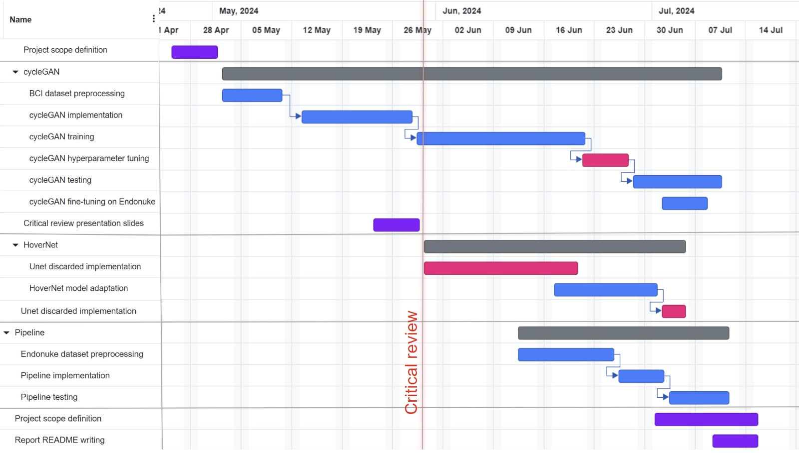

# AIDL21: GAN-based synthetic medical image augmentation

This repository contains 

### About
Final Project for the UPC [Artificial Intelligence with Deep Learning Postgraduate Course](https://www.talent.upc.edu/ing/estudis/formacio/curs/310402/postgraduate-course-artificial-intelligence-deep-learning/) 2020-2021 online edition, authored by:

* [Amaia Zurinaga Gutierrez](https://www.linkedin.com/in/amaia-zurinaga-gutierrez)
* [João Pedro Vieira](https://www.linkedin.com/in/joão-pedro-vieira-1369a51b6)
* [Josep Baradat]()
* [Jorge G. Pombo]()

Advised by [Oscar Pina]()

## Table of Contents <a name="toc"></a>

- [1. Introduction](#1_intro)
    - [1.1. Motivation](#11_motivation)
    - [1.2. Objectives](#12_objectives)
- [2. Tools and technologies](#2_toolstechnologies)
    - [2.1. Software](#21_software)
    - [2.2. Hardware](#22_hardware) 
- [3. Methodology??](#3_methodology)
    - [3.1. Time costs](#31_timecosts)
- [4. Data Overview](#4_dataoverview)
    - [4.1. Biological context](#41_biologicalcontext)
    - [4.2. BCI dataset](#42_bcidataset)
    - [4.3. Pannuke dataset](#43_pannukedataset)
    - [4.4. Endonuke dataset](#44_endonukedataset) 
- [5. Experiment's design and results](#5_experimentsdesignandresults)    
    - [5.1. cycleGAN](#51_cycleGAN)
        - [Data preprocessing](#511_datapreprocessing)
        - [Model architecture](#512_modelarchitecture)
        - [Training configuration](#513_trainingconfiguration)
        - [Fine_tuning procedure](#514_finetuningprocedure)
        - [Test results](#515_testresults)
    - [5.2. HoverNet](#52_hovernet)
        - [Data preprocessing](#521_datapreprocessing)
        - [Model architecture??](#522_modelarchitecture)
        - [Training configuration](#523_trainingconfiguration)
        - [Test results](#524_testresults)
    - [5.3. Pipeline ensemble](#53_gans)
        - [Data preprocessing](#531_datapreprocessing)
        - [Ensemble](#532_ensemble)
        - [Test results](#533_testresults)
- [6. How to Run](#6_howtorun)
- [7. Conclusions and future work](#7_conclusionsandfuturework) 
- [8. Acknowledgements](#8_acknowledgements)
 
## 1. Introduction <a name="1_intro"></a>

Over the last decade Deep Neural Networks have produced unprecedented performance on a number of tasks,

On the other hand, since their introduction by [Goodfellowet al.](https://papers.nips.cc/paper/5423-generative-adversarial-nets), Generative Adversarial Networks (GANs) have become the defacto standard for high quality image synthesis. There are two general ways in which GANs have been used in medical imaging. The first is focused on the generative aspect and the second one is on the discriminative aspect. Focusing on the first one, GANs can help in exploring and discovering the underlying structure of training data and learning to generate new images. This property makes GANs very promising in coping with data scarcity and patient privacy.


### 1.1. Motivation <a name="11_motivation"></a>


Histopathological imaging plays a **crucial role** in medical diagnosis and research. It provides a detailed view of the biological tissues at a microscopic level, enabling the identification of diseases such as cancer. Two common staining techniques used in histopathology are **Immunohistochemistry (IHC)** and **Hematoxylin and Eosin (HE)** staining.

Using of biopsy method is a reliable method to detect cancer by more confidence than utilizing only radiology. The biopsy is a medical procedure involving extraction of sample cells or tissues for fixing a part of them in formalin and paraffin on a glass microscope slide which is achieved by surgery from a breast tissue. This sample will be stained by combination of hematoxylin and eosin (H&E). This staining standard has been used for more than a century and it is first routine in pathology clinics to diagnose cancers. If the experts need to know more information about exact type of cancer they will use different biomarker such as immunohistochemistry (IHC) images or the other specific biomarker such as in situ hybridization (ISH) [4]. These complementary staining are usually used along with H&E to achieve more accurate diagnosis. ??[2]

The before mentioned **IHC staining** is a special staining process used to detect specific antigens in tissues with the help of antibodies. It is particularly useful in the identification of abnormal cells such as those found in cancerous tumors. On the other hand, **HE staining** is the most widely used staining technique in medical diagnosis. It uses hematoxylin, which stains nuclei blue, and eosin, which stains the cytoplasm and extracellular matrix pink. This results in a high contrast image that allows pathologists to distinguish different tissue structures and cell types.

However, the process of staining is time-consuming and requires expert knowledge to interpret the results. Moreover, each staining technique provides different information, and often, pathologists need to review slides under both stains for accurate diagnosis. This is where **Deep Learning** can make a significant impact.

In this project, we propose a novel approach that uses **CycleGAN**, a type of Generative Adversarial Network (GAN), to translate **IHC stained images to HE staining**. CycleGAN has shown remarkable results in image-to-image translation tasks, even when there are no paired examples in the training set. By training a CycleGAN model on unpaired IHC and HE stained images, we aim to generate synthetic HE images from IHC input. This could potentially save a significant amount of time and resources in the staining process.

After that, another deep learning model was employed to calculate **cell centroids** from the translated HE images. The location of cell centroids can provide valuable information about the spatial distribution of cells, which is often an important factor in disease diagnosis.

By leveraging deep learning to translate between different stainings and calculate cell centroids, we aim to enhance the efficiency and accuracy of histopathological imaging analysis. This could lead to faster and more accurate diagnoses, ultimately improving patient outcomes. We believe that our project will contribute significantly to the field of digital pathology and demonstrate the transformative potential of deep learning in medical imaging.

--------------------------------

Breast cancer is a leading cause of death for women. Histopathological checking is a gold standard to identify breast cancer.  To achieve this, the tumor materials are first made into hematoxylin and eosin (HE) stained slices (Figure 1). Then, the diagnosis is performed by pathologists by observing the HE slices under the microscope or analyzing the digitized whole slide images (WSI).

For diagnosed breast cancer, it is essential to formulate a precise treatment plan by checking the expression of specific proteins, such as human epidermal growth factor receptor 2 (HER2). The routine evaluation of HER2 expression is conducted with immunohistochemical techniques (IHC). An IHC-stained slice is shown in Figure 1. Intuitively, the higher the level of HER2 expression, the darker the color of the IHC image (Figure 2).

??foto

However, there are limitations to using IHC technology for assessing HER2 expression: 1) The preparation of IHC-stained sections is costly. 2) Tumors are heterogeneous, yet IHC staining is typically performed on a single pathological section in clinical settings, which may not fully represent the tumor's status.

Therefore, our goal is to directly generate IHC images from HE images. This approach would reduce the costs associated with IHC staining and allow the generation of IHC images from multiple pathological tissues of the same patient, providing a more comprehensive assessment of HER2 expression levels.Additionally, we will transform the real IHC stained images into fake HE images. This transformation will enable us to compare cell and centroid predictions between the real and fake images, ensuring the accuracy and reliability of our generated images in reflecting true pathological features.


### 1.2. Objectives <a name="12_objectives"></a>

The main purpose of this project is to elaborate a method that 
- Translate IHC images to HE and viceversa, getting the most reliable and trustworthy results as possible. 

- Build a pipeline that receives IHC images and predicts cell centroids location. But instead of training a classifier on IHC images, it will be trained exclusively on HE images, because HE images are much more abundant and, therefore, a better model can be obtained.
In order to achieve it, two models will conform the pipeline:
    - The cycleGAN created for the first objective will be fine-tuned.
    - HoverNet [??cite] will be the model trained on HE images.

Consequently, the pipeline will have the following structure:

<p align="center">
  
</p>

- Draw final conclusions from the obtained results.


## 2. Tools and technologies <a name="2_toolstechnologies"></a>

### 2.1. Software  <a name="21_software"></a>

We selected PyTorch as the framework for our AI project development due to its robust capabilities in scientific computing and deep learning. Our project leverages several key libraries and tools to enhance its functionality and performance:

**Image Transformations and Augmentations:** We utilized both Torchvision and Albumentations packages for standard augmentations and image transformations, ensuring diverse and effective training data.

**Dataset Preprocessing:** Custom functions and classes were developed for specific preprocessing needs, complemented by the skimage library for additional image processing utilities.

**Architectures and Models:** Our implementations include advanced models such as CycleGAN for image-to-image translation tasks and HoverNet for nuclear segmentation in biomedical images.

**Metrics and Evaluation:** For evaluating the quality of the synthetic images generated by CycleGAN, we employed the Fréchet Inception Distance (FID) metric, ensuring rigorous and accurate assessment of our model's performance.

This combination of powerful libraries and custom solutions has enabled the development of a robust and efficient AI system tailored to our project's requirements.


### 2.2. Hardware  <a name="22_hardware"></a> 

- ### **Collaborator's Laptops Configurations**

**MacBook Pro**
- Procesador: 2,6 GHz Intel Core i7

- Grafica: Intel UHD Graphics 630 1536 MB
  
- Memoria: 16 GB 2667 MHz DDR4


**Asus Vivobook**
 - Procesador: i7-13700H 2.40 GHz

 - RAM: 32,0 GB
 
 - OS: Windows 11
 
 - Grafica: Nvidia RTX 4060


**Lenovo Legion Pro 5**
- Procesador: AMD Ryzen™ 9 7945HX (2,50 GHz hasta 5,40 GHz)
  
- RAM: 32 GB DDR5-5200MHz (SODIMM) - (2 x 16 GB)
  
- OS: Windows 11
  
- Grafica: NVIDIA® GeForce RTX™ 4070 8 GB GDDR6


**Lenovo Legion Y720**
- Procesador: Intel Core i7-7700HQ (Quad-Core, 2.8 GHz, up to 3.8 GHz with Turbo Boost)
  
- RAM: Up to 16 GB DDR4 (2400 MHz)
  
- OS: Windows 10
  
- Grafica: NVIDIA® GeForce GTX 1060 (6 GB GDDR5 VRAM)


On an initial phase we started by training our models locally on our laptops but as the project architecture expanded, we rapidly looked for another approach due to the high computing demands, opting for [Google Cloud Platform](https://cloud.google.com/).


- ### **Google Cloud Platform**

To start, we utilized a VM from Google Cloud Platform (GCP) with an Ubuntu Image, equipped with 1 NVIDIA T4 GPU, and a machine type of n1-standard-4 (4 vCPUs, 15 GB memory). As the computational demands increased for model training and to expedite the process, we upgraded to a VM from GCP with an Ubuntu Image, featuring 1 NVIDIA L4 GPU and a machine type of g2-standard-8 (8 vCPUs, 32 GB memory).

To leverage GPU acceleration, we employed CUDA, significantly enhancing our processing capabilities. We used Google Cloud Buckets to store and import raw dataset files to the VM. Additionally, we utilized the gcloud SDK for seamless data import/export to and from the VM.

For accessing the VM and conducting our work, we established an SSH connection and utilized Visual Studio Code with the remote-ssh extension. This setup provided an efficient and flexible environment for developing and training our AI models.


## 3. Methodology <a name="3_-_methodology"></a>

One-hour meetings were held weekly between the team and the advisor. Besides from that, another two two-hour meetings were held weekly by the team without the advisor.
Moreover two sprints were done during the development procedure. The last week before the critical review, and three weeks before the final presentation. During those sprints, the amount of time spent by each student on the project was roughly doubled.

### 3.1. Time costs  <a name="31_timecosts"></a>


<p align="center">
  
</p>


--------------------??métricas??
- #### ?? (FID)


- #### Measure Assessment

Measure | Bar | 
:------: | :------:|
PSNR   | Context dependant, generally the higher the better.  | 
SSIM   |  Ranges from 0 to 1, being 1 the best value.     | 
MS-GMSD |  Ranges from 0 to 1, being 1 the best value.    |  
MDSI   |   Ranges from 0 to inf, being 0 the best value.    |
HaarPSI |   Ranges from 0 to 1, being 1 the best value.   |


## 4. Data overview <a name="4_dataoverview"></a>
We have trained and tested two different models for our final pipeline. First, we needed to perform a medical image-to-image translation task using a cycleGAN architecture. Then, an instance segmentation task of cells nuclei for medical images. 

For that we used the [BCI Dataset](https://bci.grand-challenge.org/) obtained from the Grand Challenge, the [Endonuke Dataset](https://endonuke.ispras.ru/) and the [Pannuke Dataset]().

### 4.1. Biological Context  <a name="41_biologicalcontext"></a>

### 4.2. BCI Dataset  <a name="42_bcidataset"></a>  

For training our cycleGAN model, we used the [BCI dataset](https://bci.grand-challenge.org/) obtained from the Grand Challenge. This dataset is specifically designed for medical imaging tasks and is well-suited for our project's objectives. 
It proposes a breast cancer immunohistochemical (BCI) benchmark attempting to synthesize IHC data directly with the paired hematoxylin and eosin (HE) stained images. 

The original dataset contains 9746 images (4873 pairs), 3896 pairs for train and 977 for test, covering a variety of HER2 expression levels, each with a resolution of 1024x1024 pixels. Some sample HE-IHC image pairs are shown below:


<p align="center">
  
</p>


### 4.3. Pannuke Dataset  <a name="43_pannukedataset"></a> 

For the image segmentation model training, validation and testing, we utilize the [PanNuke](https://doi.org/10.48550/arXiv.2003.10778) dataset, which is a semi-automatically generated resource designed for the segmentation and classification of nuclei. Models trained on PanNuke can aid in whole slide image tissue type segmentation, and generalize to new tissues. This dataset includes 7753 images spanning 19 different tissue types: adrenal gland, bile duct, bladder, breast, cervix, colon, esophagus, headneck, kidney, liver, lung, ovarian, pancreatic, prostate, skin, stomach, testis, thyroid and uterus. The PanNuke dataset is organized into three folds (fold 1, fold 2, and fold 3), each containing two folders: "image" and "masks." The "image" folder comprises two files: images.npy and types.npy, while the "masks" folder contains a single file: masks.npy.. 

<p align="center">
  
</p>


### 4.4. Endonuke Dataset  <a name="44_endonukedataset"></a> 
EndoNuke is a dataset designed for training models to detect nuclei in endometrium samples. It contains over 1600 image tiles, created using the immunohistochemistry technique (IHC). Each image has a physical size of 100μm x 100μm, and includes annotated nuclei locations marked as keypoints for: stroma, epithelium, and other.

<p align="center">
  
</p>

As for the dataset structure, all the data is located in a directory called “Data”. The structure is:
-/Data
    /master_ymls
    /dataset
        /metadata
        /images
        /images_context
        /iles_lists
        /labels


In “images” you will find all the images from the dataset, each one with a unique numeric filename. Thera are 1606 images with size 200x200 and 174 images with size 400x400.

In “images_context” you will find the context for each image. This is a bigger image where the image was extracted from.

In “labels”, you will find two subdirectories called “agreement” (which contains the annotations from the agreement studies) and “bulk”. Inside “bulk”, there are seven subdirectories (one for each annotator). The annotations for each image can be found inside one of these seven subdirectories as a txt file.

In “metadata” you will find image metadata in JSON format.

Finally, “files_lists” contains the files with lists of the relative filepaths for the bulk of the dataset and for the agreement studies.

The dataset can be downloaded [here.](https://endonuke.ispras.ru)


## 5. Experiment's Design and Results <a name="5_experimentsdesignandresults"></a>


### 5.1. CycleGAN  <a name="51_cyclegan"></a>

For our image-to-image translation tasks, we implemented CycleGAN, an innovative model introduced by _Jun-Yan Zhu et al._ on this [paper](https://arxiv.org/pdf/1703.10593). This architecture leverages a cycle-consistency loss to enable the transformation of images from one domain to another without direct correspondence between the datasets.

Here is a visual explanation of the overall pipeline of the CycleGAN:

<p align="center">
  
</p>


### 5.1.1. Model Architecture <a name="512_modelarchitecture"></a>


Our CycleGAN model's generator architecture includes two downsampling layers, nine residual blocks, and two upsampling layers. The discriminator architecture ias a 70 X 70 PatchGAN, consisting of a series of convolutional layers without downsampling or upsampling, progressively reducing the spatial dimensions to make real or fake predictions. The activation functions used in these networks are pivotal for their performance. Leaky ReLU is employed in the discriminator to allow a small gradient when the unit is not active, mitigating the issue of vanishing gradients. For the generator, ReLU is used in the residual blocks to facilitate efficient training and stable gradient flow. At the output layer of the generator, a Tanh activation function is used to scale the output to the range [-1, 1].

<p align="center">
  
</p>

### 5.1.2. Data Preprocessing <a name="511_datapreprocessing"></a>

- #### Dataset Resolution

Due to the high resolution of the original dataset and in order to accelerate the training process, we built the dataset class with a dynamic cropping feature to be able to work with smaller images. Before feeding them to the network, they are divided into smaller patches, yielding a total of 38984 images (19492 pairs) with a resolution of 512x512 pixels. The dataset is subsequently split into training, validation, and test sets, adhering to a ratio of 60%, 20%, and 20%, respectively.

Below follows an example of how we cropped the original dataset:

<p align="center">
  
</p>

- #### Dataset Reduction

We used just 50% of our training and validation sets, to reduce training costs, while keeping a representative sample size for good generalization. Finally, the model was trained with 15592 images (7796 pairs).

- #### Data Augmentation

In order to increase diversity on the training set, we applied several transformations to it, using Albumentations library.
For further reduction of the training time, we resized the images to 256*256. To avoid overfitting, techniques like flips and rotations were applied. Also, we applied normalization of mean and standard deviation and finally we converted the images to tensors so they can be processed by the model.


### 5.1.3. Training Configuration <a name="513_modelarchitecture"></a>

- #### First Approach
First, we trained our network from scratch and for that we used the Adam optimizer with a learning rate of 0.00001. Our early experiments involved training with a batch size of 1, 6 residual blocks in the generator and a cycle_lambda=10, which yielded good results but started overfitting after 87 epochs. 

Below we present the generators loss during the first training process:

<p align="center">
  
</p>

- #### Second Approach

However, after increasing the batch size to 2 and the number of residual blocks to 9, while maintaining the same lr and cycle_lambda, we observed a smoother convergence and a lower loss from the beginning. Additionally, we incorporated identity loss with a lambda=0.5, helping to preserve the format and characteristics of the original domain during translation. These adjustments significantly enhanced the stability and quality of the generated images. After 123 epochs the model started to overfit.

Below we present the generators loss during the second training process:

<p align="center">
  
</p>

We estimate that this improvement can be attributed to the larger batch size providing more stable gradient estimates, and the increased number of residual blocks allowing the model to capture more intricate details in the images.


### 5.1.4 Fine-Tuning <a name="514_modelarchitecture"></a>


### 5.1.5. Test Results <a name="515_modelarchitecture"></a>

After training our CycleGAN model, we evaluated its performance using several metrics on the test set. Among these, the Fréchet Inception Distance (FID) was employed, which is commonly used to assess the fidelity of generated images compared to real images. FID measures the similarity in statistics between generated and real images based on features extracted from a pre-trained Inception model. Additionally, we monitored the generator losses throughout the testing phase to gauge the convergence and stability of our model.

| Metric          | Score |
|-----------------|-------|
| FID Score (HE) | 23.22 |
| FID Score (IHC) | 48.54 |
| Generators Loss | 1.43 |

Below we also present some of the test results obtained with the BCI Dataset, which has paired images and allowed us to have a better visual perception of the model's ability to perform the pretended image-to-image translation tasks.

- #### Translation from Domain A to Domain B [G(x)]

Here are some examples with particular focus on comparing the transformation from domain A to domain B with the domain B ground truth:

<div align="center">
  
  
  <p><sub><strong>Examples of CycleGAN inference results. Left input image from IHC domain; Right input image from HE domain.</strong></sub></p>
</div>

- #### Reconstruction Translation [F(G(x))]

Here are some examples showcasing the model's cycle consistency. Each example contrasts the original images from domain A with their reconstructions obtained through transformation into domain B and back:

<div align="center">
  
  
  <p><sub><strong>Examples of CycleGAN inference results. Left input image from HE domain; Right input image from IHC domain.</strong></sub></p>
</div>


### 5.1.6. Model Limitations <a name="516_ganLimitations"></a>

There are some limitations regarding our CycleGAN model for image-to-image translation between Hematoxylin and Eosin (HE) and Immunohistochemistry (IHC) stains of medical images of body tissue.

**Color Translation Accuracy:** The model sometimes struggles to accurately translate the colors of the images from one domain to the other. This can result in discrepancies between the generated output and the ground truth images, particularly in the finer details and color gradients that are crucial for medical diagnoses.

<div align="center">
  
  <p><sub><strong>Visualization of translation from IHC to HE stained images. The output generated struggles in obtaining the desired colour.</strong></sub></p>
</div>

**High HER2 Expression Identification:** Specifically, when translating from HE to IHC stains, the model has difficulty accurately identifying regions with higher expressions of HER2. This can lead to inaccuracies in highlighting cancer areas in the IHC images, which is critical for effective diagnosis and treatment planning.

<div align="center">
  
  <p><sub><strong>Visualization of translation from HE to IHC stained images with high expression levels of HER2. The output generated does not highlight accurately the expression levels of HER2.</strong></sub></p>
</div>


**Potential Artifacts:** In line with the limitations mentioned above, the translation process may introduce artifacts or distortions that are not present in the original images. These artifacts can potentially interfere with the interpretation of the images by pathologists and clinicians.


### 5.2. Hovernet  <a name="#52-hovernet"></a>

The HoVer-Net [(_Graham et al._)](https://doi.org/10.1016/j.media.2019.101563) is a single network with multiple branches that carries out both nuclear instance segmentation and classification. This network utilizes the horizontal and vertical distances from nuclear pixels to their centers of mass to distinguish between clustered cells. Additionally, a specialized up-sampling branch is employed to classify the type of each nuclear instance segmented.

<div align="center">
  
  <p><strong>HoVer-Net original architecture (Graham et al., 2019)</strong></p>
</div>
	
### 5.2.1. Data preprocessing<a name="521_datapreprocessing"></a>

The data processing was meticulously developed to handle image and mask data from the PanNuke dataset, segmented across multiple folds. Initially, image and mask files stored in NumPy array format were aggregated from three distinct folds (Fold 1, Fold 2, Fold 3) to form comprehensive datasets. These files were accessed from nested directories structured specifically for this purpose and were concatenated to create unified arrays for images and masks. The data was then prepared for training by segmenting it into training, validation, and test subsets, which represent 60% (4740/7901), 20% (1580/7901), and 20% (1581/7901) of the data, respectively. The transformation process included converting instance segmentation masks into a format compatible with the Hover-Net architecture, which involved remapping segmentation indices and encoding cell type information into a five-channel NumPy array per image (7901, 256, 6). Each processed image was saved as a .npy file in designated directories corresponding to their respective data splits. Additionally, for inference, visualization and verification, test images were converted into PNG format (256x256) and stored, ensuring that the pixel intensity values were properly scaled to the 8-bit range suitable for standard image formats. 

### 5.2.2. Model architecture<a name="522_modelarchitecture"></a>

In the "fast" mode of the HoVer-Net model, the architecture is designed for efficiency while maintaining a strong capability for feature extraction and segmentation tasks. The model starts with an initial convolutional layer (conv0) that employs a 7x7 kernel to process the input image, followed by batch normalization and ReLU activation. This layer is prepended with a TFSamepaddingLayer to maintain the dimensionality across convolutions.

The core of the network comprises four sets of residual blocks (d0, d1, d2, d3), which progressively increase the depth and reduce the spatial dimensions of the feature maps. Specifically, the architecture includes:

- d0: 3 residual blocks, transitioning from 64 to 256 channels.
- d1: 4 residual blocks, increasing channel depth from 256 to 512.
- d2: 6 residual blocks, further deepening to 1024 channels.
- d3: 3 residual blocks, culminating in 2048 channels.
  
A convolutional bottleneck layer (conv_bot) then compresses the channel depth from 2048 to 1024 to prepare for the decoding process. The decoder architecture in the "fast" mode uses a kernel size of 3 for all convolutional operations, which is smaller than in the "original" mode, allowing for quicker processing with reduced computational overhead.

The decoder consists of four sequential stages that progressively upsample and concatenate feature maps from corresponding encoder stages, refining details through a series of dense blocks and convolutional layers. Each stage in the decoder is designed to integrate high-level semantic information with lower-level details to generate precise segmentation outputs.

The model concludes with the UpSample2x module, used at each decoder stage to gradually restore the resolution of the output feature maps, culminating in the final segmentation maps corresponding to different types of predictions (nuclear, cytoplasmic, etc.), depending on the configuration.

<div align="center">
  
  <p><strong>Hovernet "fast" architecture</strong></p>
</div>

### 5.2.3. Training configuration<a name="523_modelarchitecture"></a>

In the training configuration of our project, we adopted a structured multi-phase approach to train the neural network using the HoVer-Net model in its 'fast' mode. The model was equipped with a total of 16 residual blocks distributed across four distinct depth levels: 3 blocks in d0, 4 blocks in d1, 6 blocks in d2, and 3 blocks in d3. This architecture was selected to optimize the model’s learning capabilities for faster execution without compromising the integrity of feature extraction.

Each phase was precisely defined to control the learning process, with an Adam optimizer initiated at a learning rate of 0.0025, fine-tuned through a MultiStepLR scheduler at predetermined epochs to enhance training efficacy. We managed the batch sizes at 2 for both training and validation to ensure a balance between computational resource utilization and model accuracy.

Throughout the training process, key metrics were meticulously recorded and saved using a series of callbacks integrated into the training and validation engines. These included ScalarMovingAverage for tracking moving averages of scalar metrics, TrackLr for monitoring learning rate changes, and PeriodicSaver for saving model states periodically. Additionally, VisualizeOutput and LoggingEpochOutput were employed to log and visualize outputs at each epoch, providing vital feedback on model performance and stability. AccumulateRawOutput and ProcessAccumulatedRawOutput played crucial roles during validation phases, collecting and processing outputs for detailed analysis.

<div align="center">
  
</div>

<div align="center">
  
</div>

Initially, we commenced training our model using the Pannuke dataset according to the method outlined above. However, to optimize our resource utilization and expedite the development process, we decided to leverage the pretrained model checkpoints shared by the HoVer-Net creators with the community. By starting from these pretrained checkpoints, we significantly reduced the amount of time required for training and fine-tuning our model. This strategic decision not only accelerated our project timeline but also ensured that we maintained high standards of accuracy and efficiency in our model's performance, benefiting from the robust foundation provided by the pretrained model.

### 5.2.4. Test results<a name="524_modelarchitecture"></a>


We utilized several key metrics to comprehensively evaluate the performance of the HoVer-Net model in the segmentation of cellular nuclei in Pannuke images. The Dice Coefficient (DICE), a metric that measures the overlap between the model’s predictions and the true data, showed a performance of 0.82773, indicating a high degree of precision in pixel-level segmentation. The Average Jaccard Index (AJI), which assesses the intersection over union of predicted and actual instances, was recorded at 0.66529, reflecting the model’s effectiveness in distinguishing individual instances. To evaluate the model's capabilities in both detection and segmentation, we employed the Panoptic Quality (PQ) metric, combining Detection Quality (DQ) and Segmentation Quality (SQ). The PQ score was 0.63851, supported by DQ and SQ scores of 0.76210 and 0.81638 respectively, demonstrating the model’s robustness in accurately detecting and segmenting instances. The enhanced metric Average Jaccard Index Plus (AJI+), which considers additional factors like segmentation fragmentation, further validated the model’s detailed performance with a score of 0.67720.

| Metric           | Score   |
|------------------|---------|
| Dice Coefficient (DICE) | 0.82773 |
| Average Jaccard Index (AJI) | 0.66529 |
| Detection Quality (DQ) | 0.76210 |
| Segmentation Quality (SQ) | 0.81638 |
| Panoptic Quality (PQ) | 0.63851 |
| Average Jaccard Index Plus (AJI+) | 0.67720 |


### 5.3. Pipeline ensemble <a name="53-endonukedataset"></a> 
- Data preprocessing<a name="531_datapreprocessing"></a>

In our project, we will use the Endonuke dataset for the pipeline. This means that we will create fake HE-images with the CycleGAN model using the images from the Endonuke dataset and then we will calculate the centroids of these fake images using the Hovernet model. Finally, we will compare the predicted and real centroids, as a way of evaluating our models together.

The information of the centroids of each image is stored in the labels/bulk subdirectory, where we will find the annotations for each image as a txt file. These annotations consist of three columns. The two first columns are the x-coordinate and the y-coordinate of the centroid of each cell. The third column is the class_label: 1 for stroma, 2 for epithelium and 0 for other.

For our pipeline, we won’t focus on the type of cells, just on detecting them and calculating its centroid. That’s why we won’t use the class_label column.

In order to use this dataset with theCycleGAN model, we will have to preprocess it. By doing so, we will have images of the appropriate size (256x256) and the recalculated coordinates of the centroids of these images.

Once you have downloaded the dataset, you must change the path to the “Data” folder In the config.py file from the Datasets/Endonuke folder

Then, by executing the preprocessing.py file you will create six new subdirectories in the “Data” directory called: ”clean_images”, “txt_files”, “resized_images”, “resized_txt”, “crop_images”, and “crop_txt”. The process will be as it follows:
Copy all images to “clean_images” 
We group all the txt files from the seven labels/bulk subdirectories to “txt_files”
Delete images from “clean_images” that don’t have a corresponding txt file (only 40 images don’t have a corresponding txt file)
We resize all images to 400x400 and save them in “resized_images” 
Adapt centroids coordinates to this 400x400 images and save only the coordinates in txt files in “resized_txt”
Take three 256x256 crops of each image and save them in “crop_images”
Recalculate the centroids of the 400x400 images on the cropped images and save them in txt files in “crop_txt”

After doing this, we will use the images and txt files from the “crop_images” and “crop_txt” folders in our pipeline.

As for the crops, in order to take as much different information from the 400x400 images as possible, we are cropping the right top zone, the left top zone, and the bottom middle zone.

<p align="center">
  
</p>

- Ensemble<a name="532_emsemble"></a>

The objective of the pipeline is to compare the real centroids of the IHC images with the predicted centroids of the fake HE images generated with the CycleGAN model and calculated with the Hovernet model.

To do this comparison, we will use the CellDetectionMetric defined in the celldet.py file. This metric will enable us to do “Hungarian Matching” between the real and predicted centroids of each image based on its distance.

To use this CellDetectionMetric, we will have to store the real and predicted centroids’ coordinates in two dictionaries in the format needed for CellDetectionMetric. That’s why we created a class dataset called DicDataset. The dataset will require a path to a directory with the txt files containing the real centroids and a path to the directory to the JSON files with the predicted centroids. For each image, both files will have the same name, so we will use it to join them.

The dataset will return the name (equal for both files), the dictionary with the real centroids and the dictionary with the predicted centroids. These dictionaries will be like this:

Dictionary for real centroids:
{
	“boxes”: tensor([x_coor. 1, y_coor. cell 1], [x_coor. 2, y_coor. cell 2]…)
	“labels”: torch.ones(len(centroids), dtype=torch.float32)
}

Dictionary for predicted centroids:
{
	“boxes”: tensor([x_coor. 1, y_coor. cell 1], [x_coor. 2, y_coor. cell 2]…)
	“labels”: torch.ones(len(centroids), dtype=torch.float32)
	“scores”: torch.ones(len(centroids), dtype=torch.float32)
}

In the pipeline, we will use the already created images from the crop_images folder and the already created txt files from the crop_txt folder.

First, we will create the gan_results_folder and the result_hover_folder. We will also store their paths into two separate variables.

Then, we will create a fake HE image from each cropped image using the CycleGAN model and the weights we obtained from training it. We will store the resulting images in the gan_results_folder and with the same name as the original cropped images.

Up next, we will use the Hover-Net model and the calculated weights to obtain the results of the instance segmentation for the fake HE images. These results will be stored in the result_hover_folder and here we will find a folder containing the JSON files where the predicted centroids are located. We will store the path to this folder in a variable called json_hover_folder.

Then we will create a metric variable with CellDetectionMetric. We will set “num_classes” to one since we are differentiating between different cell types (that’s why all labels in the dictionary will be 1) and the “thresholds” will be set to 0.5.

We will also define our dataset. For it, we will use the variables where we store the paths to the cropped txt files and to the JSON files.

Then, we will create two lists and. In a for loop, for each datapoint of the dataset, we will append the real centroids dictionaries to the first one and the predicted centroids dictionaries to the second one.

We use these dictionaries’ lists to update the metric. Finally, we will compute the results.

- Test results<a name="533_modelarchitecture"></a>


## 6. How to Run <a name="6_howtorun"></a>

- clone the repository.
- Create new environment using python 3.8??
- run: pip install -r requirements.txt 

### How to download and prepare datasets

#### BCI Dataset

1. Download BCI Dataset from [here](https://drive.google.com/file/d/1jPPh-rxUaj_bCB58F9mfg9hjY7JjVt3O/view?usp=drive_link). If it is not possible, you can also enter on [this](https://drive.google.com/drive/folders/1jApbId20lX8AY0tIsoX2_2BHBLPoxD4L) google drive folder and download it from there.
  
2. Extract and save the dataset

	After downloading the dataset you will obtain a `.zip` file called `BCI_dataset`. You should extract the content inside that should be a folder called `BCI_dataset`, rename it to `BCI` and save it on the `/path/to/the/repository/Datasets`.

	Once you have done that, the file structure should be like this: 

	```
	 IHC_HE_GenAI
	  ├──Datasets
	       ├── BCI
		     ├──train
		     |    ├── 00000_train_1+.png
		     |    ├── 00001_train_3+.png
		     |    └── ...
		     └──test
			  ├── 00000_test_1+.png
			  ├── 00001_test_2+.png
			  └── ...
	```

### Endonuke Dataset

### Pannuke Dataset


### How to train CycleGAN

1. File structure and description
	```
	 IHC_HE_GenAI
	  ├──cycleGAN
	     ├── __init__.py
	     ├── config.py
	     └── ...
	```
 	
 	The python scripts inside `/path/to/the/repository/cycleGAN` are as follow:
	
 	| File          | Description |
	|-----------------|-------|
	| init.py  | Initializes the package and can include any necessary package-level variables or imports |
	| config.py | Contains configuration settings and hyperparameters for the CycleGAN model, including paths, image transformations, training parameters, and model parameters |
	| discriminator.py | Defines the architecture and implementation of the discriminator networks used in the CycleGAN |
	| generator.py | Defines the architecture and implementation of the generator networks used in the CycleGAN |
	| HE_IHC_dataset.py | Manages the loading, preprocessing, and augmentation of the HE and IHC datasets for training and testing |
	| train.py | Contains the training loop and logic for training the CycleGAN model, including loss calculations and model updates |
	| test.py | Implements the testing and evaluation logic for the trained CycleGAN model on new data |
	| utils.py | Provides utility functions used throughout the project, such as saving/loading models, and other helper functions |
	| evaluate.py | Contains functions for evaluating the performance of the CycleGAN model |


2. Change configuration settings and hyperparameters for the CycleGAN model

	Open the `/path/to/the/repository/cycleGAN/config.py` and change the `TRAIN_DIR_IHC` and `TRAIN_DIR_HE` variables to these:
	```
 	TRAIN_DIR_IHC = bci_dataset_ihc_train   
 	TRAIN_DIR_HE = bci_dataset_he_train
 	```
 	Then, open the `/path/to/the/repository/cycleGAN/utils.py` file and change `import cycleGAN.config as config` to `import config`. If you want you can change other hyperparameters (e.g. learning rate, batch_size, num_res_blocks, etc), which are all on the `/path/to/the/repository/cycleGAN/config.py`, to compare the difference in training time and results. All the hyperparameters are described on that file, for better understanding of their role in the model.


3. Run the following command on the terminal to start training the model:
	```
 	python3 /path/to/the/repository/cycleGAN/train.py
 	``` 
	You can monitor and track the model training by opening with tensorboard the `/path/to/the/repository/cycleGAN/logs` folder, where you can find different metrics. Also, you can check some examples of the cycleGAN output images throughout training, validation and test in `/path/to/the/repository/cycleGAN/gan-img/` to have a better visual understanding of the outputs the model is generating.


### Pipeline:

- Download the Endonuke dataset [here.](https://www.ispras.ru/conf/endonuke/data.zip) (source: [https://endonuke.ispras.ru/)](https://endonuke.ispras.ru/))
- Extract the downloaded zip folder in IHC_HE_GenAI/Endonuke. The folder should end up like this:
  IHC_HE_GenAI/Endonuke/ - data/  - dataset/
                                  - master.ymls
                         - __init__.py
                         - crop.py
                         - preprocessing.py
                         - resize.py

- Download weights from both cycleGAN and HoverNet models [here.](https://drive.google.com/drive/folders/1_51IjiAmS7YoofXW-xpsaui44lC46Ko8?usp=drive_link) 
- Extract both weight files (hovernet_fast_pannuke_type_tf2pytorch.tar and pretrained-cycleGAN.zip) in IHC_HE_GenAI/pretrained_models. The folder should end up like this:
  IHC_HE_GenAI/pretrained_models/ - hovernet_fast_pannuke_type_tf2pytorch
                                  - discriminator_HE.tar
                                  - discriminator_IHC.tar
                                  - generator_HE.tar
                                  - generator_IHC.tar
´
- run: Datasets/Endonuke/preprocessing.py if it is the first time you execute it, to generate preprocessed data.
- run: pipeline_run.py

- The intermediate results (fake HE images generated by the cycleGAN) will be stored in IHC_HE_GenAI/Results/gan_results.
- The final results (fake HE images with predicted centroids) will be stored in IHC_HE_GenAI/Results/hover_results.


This steps will execute the whole pipeline inference procedure using our pretrained models. 

If the user intention is to to train cycleGAN or HoverNet, the following steps can be taken:

### CycleGAN:


### Hovernet:


## 7. Conclusions and Future Work  <a name="7_conclusionsandfuturework"></a>

* **Training GANs** proved to be a **hard task**.
    * Requires a vest amount of **resources**.
    * **Training process** is **not straightforward**.

* **SNGAN outperformed** DCGAN, ACGAN and WGAN.
    * Even though **after huge amount of experimentation** metrics were still far from initial goal.

* On the **GAN training parametrization**:
    * **Batch size** is among the most relevant parameters to reduce training times and improve image quality. The reasonale behind this effect could come from the _Discriminator_ having less examples to generalize its classification of real and fake images.
    * The number of **training epochs** also affects the quality of the generated images. Longer traning usually ends up producing better images even though the two losses did not converge.
    * Another parameter tweak that comes handy when training these architectures is the **size of the latent vector**. With higher sizes the quality of images did not improve, but it did reduce the training time.
    * **Label smoothing** has another critical change that was done in our GANs. It did produce better images and also it did stabilize the training. Mathematically, the class probabilities of the discriminator are, in general, lower when using this technique and thus, it balances the performance of the _Discriminator_ and the _Generator_.
    * **Spectral normalization**, which deals with exploding gradients, did also increase the quality of the generated images. It gave out a new architecture purely based on a DCGAN.
    * **Different learning rates**, more specifically with higher values for the _Discriminator_, did stabilize training and also increased the quality of the images. The explanation behind this behavior is that setting bigger steps for optimizing the loss function of the _Discriminator_  makes this agent more imprecise at the classification task whereas the smaller steps for the _Generator_ gives it a more precise approach to image generation.

* **Different metrics** are sensible to **different aspects** of image quality.
    * Best practice to **use a set** of them to assess the generated images.
    * **Include a metric** based on **human perception**.
 
* Good results for a **lack** of **resources**.
    * Fine-tuned **EfficientNet** achieves **high accuracy** with **reduced dataset**.
    * Dataset with **sysnthetic images** does **not improve accuracy**.
    * **Balanced dataset** with **synthetic images** and no augmentations achieves **good results**.

## 8. Acknowledgements <a name="8_acknowledgements"></a>

We’re really grateful to the team from the Postgraduate Course on Artificial Intelligence with Deep Learning. Their hard work and attention to detail in preparing the course materials and lectures gave us everything we needed for this project.

A special thanks goes to Oscar, our advisor. His advice was critical, and the time he spent reviewing our work and finding helpful tips for our project made a big difference.


## Refs??
Essam H. Houssein, Marwa M. Emam, Abdelmgeid A. Ali, Ponnuthurai Nagaratnam Suganthan,
Deep and machine learning techniques for medical imaging-based breast cancer: A comprehensive review,
Expert Systems with Applications,
Volume 167,
2021,
114161,
ISSN 0957-4174,
https://doi.org/10.1016/j.eswa.2020.114161.

??Ejemplo cite: [Frid-Adar et al.](https://arxiv.org/abs/1803.01229)

Pendar Alirezazadeh, Behzad Hejrati, Alireza Monsef-Esfahani, Abdolhossein Fathi,
Representation learning-based unsupervised domain adaptation for classification of breast cancer histopathology images,
Biocybernetics and Biomedical Engineering,
Volume 38, Issue 3,
2018,
Pages 671-683,
ISSN 0208-5216,
https://doi.org/10.1016/j.bbe.2018.04.008.
